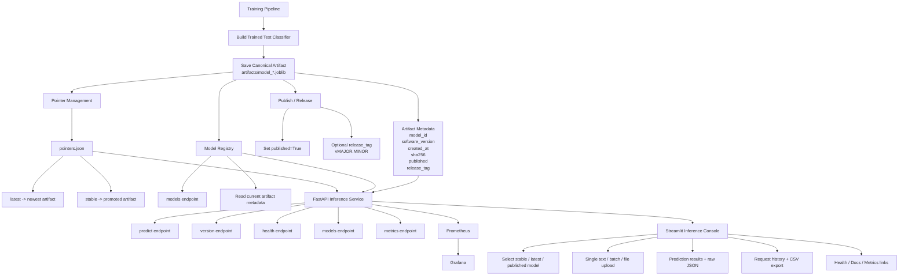
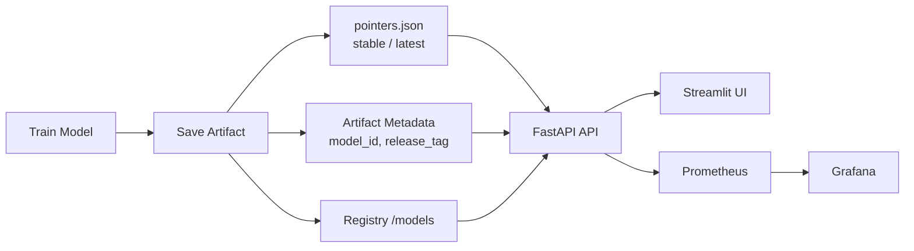

# End-to-End Production-Ready AI Inference Platform

Modern, production-style text classification service with:

- FastAPI + Pydantic v2 for a typed, OpenAPI-compliant HTTP API  
- Dockerized deployment with model versioning and promotion (latest / stable)  
- Structured logging, Prometheus metrics, and optional Grafana Cloud integration  
- Strong type safety and testing (mypy, pytest)  
- A generated Python client SDK for downstream integration

> Repository: https://github.com/sepantakamali/E2EPRAIIP

---

## Architecture

This system implements a production-style ML inference pipeline covering model lifecycle, deployment, and observability.

### Full Architecture



### Simplified Flow



## Features

- **FastAPI inference microservice**  
  - `/health` and `/predict` endpoints  
  - Built-in request validation (Pydantic v2)  
  - Automatic OpenAPI / Swagger docs at `/docs` and `/redoc`

- **Model versioning & promotion**  
  - Versioned artifacts stored under `artifacts/`  
  - Pointers for `latest` and `stable` models (`model_latest.joblib`, `model_stable.joblib`)  
  - CLI and helper scripts to train, save, and promote models

- **Production-style deployment**  
  - Dockerfile for building `textclf-api` images  
  - `docker-compose.product.yml` for the product/API deployment stack  
  - `docker-compose.monitor.yml` for Prometheus + Grafana monitoring  
  - `docker-compose.yml` as a lightweight local/dev compose setup

- **Observability & rate limiting**  
  - `/metrics` endpoint with Prometheus client metrics  
  - Custom application metrics:
    - `pred_requests_total`
    - `pred_request_errors_total`
    - `pred_latency_seconds` (histogram)
  - Optional integration with Grafana Cloud via `remote_write`  
  - SlowAPI-based rate limiting on `/predict` (IP-based)

- **Quality gates**  
  - `pytest` test suite, including API tests (`tests/test_api.py`)  
  - `mypy` static type checking across `src/`  
  - Configurable logging via `logging_conf.py`

- **Client SDK**  
  - OpenAPI schema exposed at `/openapi.json`  
  - Generated Python client in `textclf_client/` for programmatic use  
  - Install locally with: `pip install -e textclf_client`
  - Example usage in `client_demo.py`

## Production deployment (Render)

A public demo deployment is available on Render:

- Current demo: https://e2epraiip.onrender.com

- Base URL: `https://e2epraiip.onrender.com`
- Health check: `GET /health`
- OpenAPI docs: `GET /docs`
- Metrics: `GET /metrics` (if exposed)

Example request:

```bash
curl -X POST "https://e2epraiip.onrender.com/predict?model=stable" \
  -H "Content-Type: application/json" \
  -d '{"texts":["Hockey fans were ecstatic after the playoff win."],"return_prob":false}'
```

---

## Tech Stack

- **Language**: Python 3.11+
- **Web Framework**: FastAPI
- **Validation**: Pydantic v2
- **Model Persistence**: joblib
- **Containerization**: Docker
- **Rate Limiting**: SlowAPI
- **Monitoring**: Prometheus, optional Grafana Cloud
- **Testing**: pytest
- **Typing**: mypy

---

## Project Structure

```text
.
├── src/
│   └── textclf/
│       ├── api.py             # FastAPI application & endpoints
│       ├── cli.py             # CLI for training/promoting models
│       ├── persistence.py     # Model save/load, runlog, promotion logic
│       ├── logging_conf.py    # Logging configuration
│       ├── predict.py         # CLI prediction tool
│       └── ...
├── monitoring/
│   ├── prometheus.yml         # Prometheus config (local + remote_write)
│   └── alerts.yml             # Example alert rules
├── tests/
│   ├── test_api.py
│   ├── test_versioning.py
│   └── test_promotion.py
├── docker-compose.product.yml # Product/API deployment stack
├── docker-compose.monitor.yml # Monitoring stack (Prometheus/Grafana)
├── docker-compose.yml         # Lightweight local development compose
├── Dockerfile                 # Build textclf-api image
├── client_demo.py             # Example usage of the generated Python client
├── .env.example               # Example environment variables (no secrets)
└── README.md
```

---

## Authentication

Protected endpoints use Bearer token authentication.

Protected routes include:

- `/predict`
- `/models`
- `/version`
- `/whoami`

Tokens are issued using:

```bash
python scripts/issue_token.py \
  --subject client-demo \
  --client-id client-demo \
  --scopes predict:run version:read whoami:read health:read
```

The generated SDK supports authenticated usage through `AuthenticatedClient`.

---

## Generated Python SDK

The repository includes a generated OpenAPI-based Python SDK under:

```text
textclf_client/
```

Regenerate the SDK:

```bash
openapi-python-client generate \
  --url http://localhost:8000/openapi.json \
  --overwrite \
  --output-path textclf_client
```

Example usage:

```bash
python client_demo.py
```

---

## Local Development

Load environment variables:

```bash
set -a
source .env
set +a
```

Run the API locally:

```bash
uvicorn textclf.api:app \
  --host 127.0.0.1 \
  --port 8000 \
  --loop asyncio \
  --reload
```

Run the Streamlit UI:

```bash
streamlit run ui/app.py
```

Run tests:

```bash
pytest
```

Run type checking:

```bash
mypy src
```

---

## Docker

Run product stack:

```bash
docker compose -p textclf-product -f docker-compose.product.yml up -d
```

Run monitoring stack:

```bash
docker compose -p textclf-monitor -f docker-compose.monitor.yml up -d
```

Stop containers:

```bash
docker compose down
```

---

## Monitoring

Default local endpoints:

```text
API:        http://localhost:8000
Swagger:    http://localhost:8000/docs
UI:         http://localhost:8501
Prometheus: http://localhost:9090
Grafana:    http://localhost:3000
```

---

## CI/CD

GitHub Actions workflows:

- CI pipeline:
  - pytest
  - mypy
- Docker pipeline:
  - build image
  - push image to GHCR

---

## Current Status

Implemented:

- FastAPI inference API
- Model versioning and promotion
- Typed OpenAPI schema
- Generated Python SDK
- Token-based authentication
- Streamlit UI
- Docker deployment
- Prometheus monitoring
- Grafana integration
- Structured logging
- pytest + mypy quality gates
- GitHub Actions CI
- GHCR image publishing

Remaining work:

- dependency pinning refinement
- deployment automation
- final CI/CD polish
- cloud deployment hardening