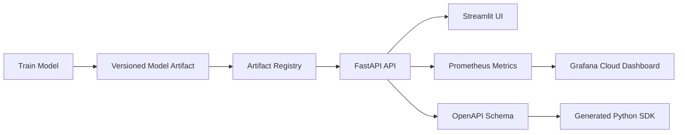
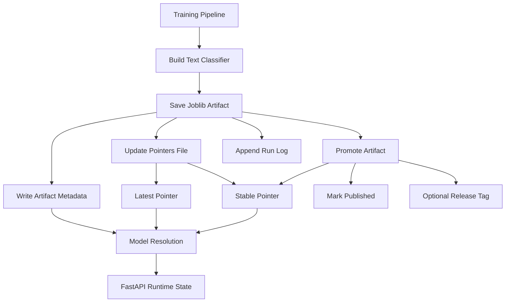
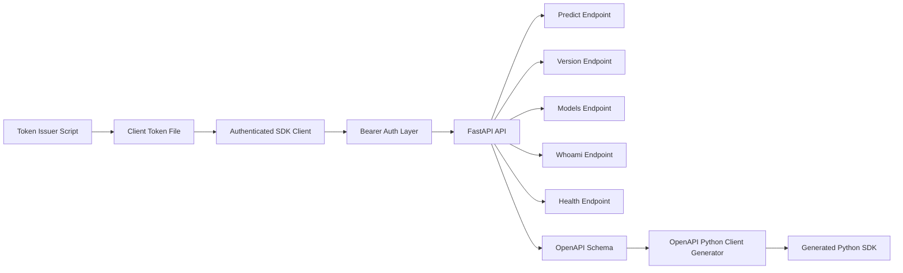
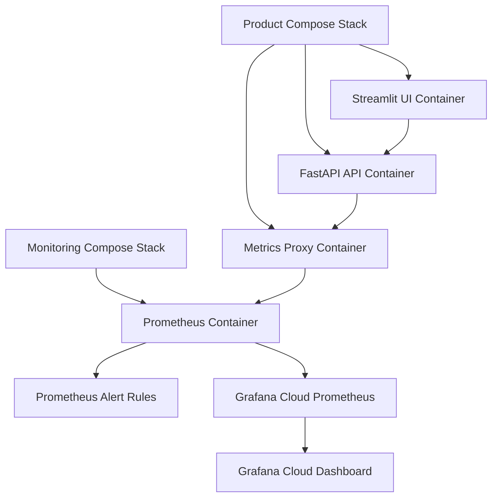

# End-to-End Production-Ready AI Inference Platform

A reusable production-ready AI inference platform demonstrating secure deployment, model serving, observability, authentication, CI/CD, and cloud-native infrastructure.

The current reference application is a text classification model served through FastAPI, but the platform is designed to host multiple AI inference workloads.

> Repository: <https://github.com/sepantakamali/E2EPRAIIP>

---

## What This Project Provides

- A trained text classification model served through a typed FastAPI API
- Versioned model artifacts with metadata, `latest`, and `stable` pointer resolution
- A Streamlit UI for local/product-style interaction with the inference service
- Bearer-token authentication with scoped tokens
- Prometheus metrics, Prometheus alert rules, and Grafana Cloud dashboards
- Docker Compose stacks for product and monitoring environments under `deploy/`
- A generated OpenAPI Python SDK for downstream integration
- Automated quality gates with `pytest`, `mypy`, GitHub Actions, and GHCR image publishing
- GitHub Actions workflows for CI, GHCR image publishing, product deployment, monitoring deployment, and Grafana dashboard-as-code
- HTTPS deployment with Let's Encrypt and Nginx reverse proxy

---

## Architecture

The project is easier to understand as several connected layers rather than one large diagram.

### 1. System Overview



### 2. Model Lifecycle



### 3. API, Authentication, and Client Flow



### 4. Docker and Monitoring Layout



---

## Features

### FastAPI Inference Service

Protected endpoints include:

- `POST /predict`
- `GET /version`
- `GET /models`
- `GET /whoami`

Operational endpoints include:

- `GET /health` (public liveness endpoint)
- `GET /ready` (public readiness endpoint)
- `GET /health/details` (internal diagnostics endpoint)
- `GET /metrics` (internal Prometheus endpoint)
- `GET /openapi.json` when documentation is enabled
- `GET /docs` when documentation is enabled

Main API features:

- Pydantic v2 request and response schemas
- OpenAPI schema generation
- Bearer-token authentication
- Scoped token support
- Structured request logging
- Request IDs
- Runtime model metadata reporting
- Prometheus metric instrumentation

### Model Versioning and Promotion

The model lifecycle supports:

- versioned `.joblib` artifacts under `artifacts/`
- artifact metadata including model ID, software version, creation time, hash, publication status, and release tag
- `pointers.json` for `latest` and `stable` model resolution
- run logging through `runs.model`
- model promotion from candidate artifact to stable artifact
- model selection by pointer, model ID, or artifact filename

### Streamlit UI

The Streamlit interface supports:

- single text prediction
- batch prediction
- file upload
- model selection
- prediction result display
- raw JSON inspection
- request history
- CSV export
- helpful links to API and monitoring endpoints

### Generated Python SDK

The SDK is generated from the FastAPI OpenAPI schema and lives under:

```text
textclf_client/
```

It provides:

- typed request models
- typed response models
- endpoint wrapper functions
- authenticated client support through `AuthenticatedClient`
- reusable integration code for external Python consumers

### Observability

Monitoring support includes:

- Prometheus scraping
- Prometheus alert rules
- Grafana Cloud dashboards provisioned from version-controlled JSON
- dashboard-as-code synchronized through GitHub Actions
- Prometheus `remote_write` to Grafana Cloud  
- latency percentiles
- process metrics
- runtime metrics
- structured application logs

### Deployment

### Deployment Files

- Dockerfile
- docker-compose.product.yml
- docker-compose.monitor.yml
- docker-compose.yml
- grafana/dashboards/e2epraiip-overview.json
- scripts/sync_grafana_dashboard.sh

deploy/
    docker-compose.product.yml
    docker-compose.monitor.yml

monitoring/
    prometheus.yml
    alerts.yml

grafana/
    dashboards/

### Deployment Capabilities

- Oracle Cloud Infrastructure (OCI) Ubuntu Server deployment
- Docker Compose orchestration
- GitHub Container Registry (GHCR) image distribution
- host-mounted model artifacts
- environment-driven model selection through MODEL_POINTER
- GitHub Actions deployment workflows
- Nginx reverse proxy with HTTPS
- Cloudflare DNS integration
- Automatic TLS certificate provisioning with Let's Encrypt

---

## Project Structure

```text
.
├── .github/
│   └── workflows/              # CI, Docker, product, monitoring, and Grafana workflows
├── artifacts/                  # Model artifacts, pointers, and run logs
├── deploy/                     # VM deployment Compose files
│   ├── docker-compose.product.yml
│   └── docker-compose.monitor.yml
├── grafana/                    # Grafana Cloud dashboard-as-code
│   └── dashboards/
│       └── e2epraiip-overview.json
├── monitoring/                 # Prometheus scrape and alert configuration
│   ├── prometheus.yml
│   └── alerts.yml
├── nginx/                      # Metrics proxy configuration
│   └── metrics.conf
│   └── ui.conf
├── logs/                       # Local application log files
├── scripts/                    # Token, setup, dashboard sync, and utility scripts
│   ├── issue_token.py
│   └── sync_grafana_dashboard.sh
├── src/
│   └── textclf/
│       ├── api.py
│       ├── cli.py
│       ├── config.py
│       ├── data.py
│       ├── logging_conf.py
│       ├── model.py
│       └── persistence.py
├── tests/
├── textclf_client/             # Generated Python SDK package
├── ui/                         # Streamlit frontend
├── Dockerfile
├── docker-compose.product.yml  # Local/product-style compose file
├── docker-compose.monitor.yml  # Local monitoring compose file
├── docker-compose.yml          # Lightweight local development compose file
├── client_demo.py
├── client_config.yaml
├── pyproject.toml
├── requirements.txt
├── Makefile
├── .env.example
└── README.md
```

---

## Authentication

Protected routes use Bearer token authentication.

Tokens are issued with:

```bash
python scripts/issue_token.py \
  --subject client-demo \
  --client-id client-demo \
  --scopes predict:run version:read whoami:read health:read \
  --rotation-group client-demo
```

```text
Available scopes can be listed with:
```

```bash
python scripts/issue_token.py --list-scopes
```

```text
Tokens support scoped permissions and rotation.
```

The raw token should be stored outside the repository. For the demo client, the token path is configured through:

```env
CLIENT_DEMO_TOKEN_FILE=../practice_sprint_secrets/client_demo_token.txt
```

Before running local scripts that depend on `.env`, load environment variables:

```bash
set -a
source .env
set +a
```

---

## Generated Python SDK

Regenerate the SDK from a running local API with documentation enabled:

```bash
openapi-python-client generate \
  --url http://127.0.0.1:8000/openapi.json \
  --overwrite \
  --output-path textclf_client
```

Run the demo client:

```bash
python client_demo.py
```

The demo client uses:

- `AuthenticatedClient`
- `PredictRequest`
- bearer token loaded from `CLIENT_DEMO_TOKEN_FILE`
- explicit model selection

```text
Model selection supports pointer names such as `stable` and `latest`, specific model IDs, or artifact filenames depending on API configuration.
```

---

## Local Development

Load environment variables:

```bash
set -a
source .env
set +a
```

Run the API locally:

```bash
SHOW_DOCS=1 INTERNAL_ONLY_ENABLED=false RATE_LIMIT_ENABLED=0 \
uvicorn textclf.api:app \
  --host 127.0.0.1 \
  --port 8000 \
  --loop asyncio \
  --reload
```

Run the Streamlit UI locally:

```bash
streamlit run ui/app.py
```

Run tests:

```bash
pytest
```

Run type checking:

```bash
mypy src
```

---

## Docker Usage

Start the product stack:

```bash
docker compose --env-file .env -f deploy/docker-compose.product.yml up -d
```

Start the monitoring stack:

```bash
docker compose --env-file .env -f deploy/docker-compose.monitor.yml up -d
```

Stop the product stack:

```bash
docker compose --env-file .env -f deploy/docker-compose.product.yml down
```

Stop the monitoring stack:

```bash
docker compose --env-file .env -f deploy/docker-compose.monitor.yml down
```

The public entry point is an Nginx reverse proxy serving https://hastikamali.com over ports 80 and 443. Streamlit, FastAPI, Prometheus, and the metrics proxy communicate only over internal Docker networks.

In this deployment:

- `/health` and `/ready` are public operational endpoints.
- `/health/details` and `/metrics` remain internal-only.
- `/predict`, `/version`, `/models`, and `/whoami` require Bearer authentication.

---

### Reverse Proxy

The platform uses Nginx as the single public entry point.

Features include:

- TLS termination
- Let's Encrypt certificates
- HTTP→HTTPS redirect
- HTTP/2
- Reverse proxying
- Internal Docker networking

## Monitoring

Typical deployed endpoints:

```text
Public UI:
https://hastikamali.com

Prometheus:
localhost only

Grafana:
Grafana Cloud
```
Prometheus runs locally on the VM, evaluates alert rules, and forwards metrics to Grafana Cloud using remote_write.

When running the API directly outside Docker, these are also available if docs are enabled:

```text
API:          http://127.0.0.1:8000
Swagger Docs: http://127.0.0.1:8000/docs
OpenAPI JSON: http://127.0.0.1:8000/openapi.json
```

Useful Prometheus queries:

```promql
up{job="textclf-api"}
```

```promql
prediction_requests_total{job="textclf-api"}
```

```promql
sum(rate(prediction_requests_total{job="textclf-api"}[5m]))
```

```promql
histogram_quantile(
  0.95,
  sum(rate(prediction_latency_seconds_bucket{job="textclf-api"}[5m])) by (le)
)
```

### Dashboard

The Grafana Cloud dashboard includes:

- API availability
- Requests per second
- Predictions served (last hour)
- Prediction error count
- Prediction error rate
- P05, P50, P95 and P99 latency
- CPU usage
- API memory usage (RSS)
- Open file descriptors
- Python garbage collection activity

---

## API Example

Example authenticated request:

```bash
TOKEN="$(cat ../practice_sprint_secrets/client_demo_token.txt)"

curl -X POST "http://127.0.0.1:8000/predict?model=stable" \
  -H "Authorization: Bearer ${TOKEN}" \
  -H "Content-Type: application/json" \
  -d '{
    "texts": ["Hockey fans were ecstatic after the playoff win."],
    "return_probabilities": false
  }'
```

---

## Testing

Current tests cover:

- API smoke path with isolated temporary model artifacts
- dataset loading and split invariants
- model training and prediction
- artifact save/load/versioning behavior
- promotion behavior

Run all quality checks:

```bash
pytest
mypy src
```

---

## CI/CD

GitHub Actions currently provide:

- CI workflow:
  - dependency installation
  - `mypy src`
  - `pytest -q`
- Docker workflow:
  - Multi-architecture Docker build (`linux/amd64`, `linux/arm64`)
  - GHCR authentication
  - Image publishing to GitHub Container Registry
  - Image tagging (`latest`, `main`, `sha-<commit>`)
  - GitHub Actions build cache reuse
- Product deployment workflow
- Monitoring deployment workflow
- Grafana deployment workflow

Implemented:

- GitHub Actions CI
- Multi-architecture Docker image publishing
- GHCR image registry
- Automated product deployment
- Automated monitoring deployment
- Automated Grafana Cloud dashboard synchronization
- Oracle Cloud Infrastructure deployment
- Docker Compose deployment
- SSH-based server administration

Remaining:

- Infrastructure as Code (Terraform)
- Production validation
- Security hardening review


## Deployment

### Deployment Journey

The deployment process was developed incrementally:

1. Local development using Uvicorn.
2. Containerized execution with Docker Compose.
3. Validation on a local Ubuntu Server virtual machine.
4. Production deployment to an Oracle Cloud Infrastructure virtual machine.
5. GitHub Container Registry (GHCR) for image distribution.
6. Automated product deployment through GitHub Actions.
7. Automated monitoring deployment through GitHub Actions.
8. Automated Grafana Cloud dashboard synchronization.

### Container Registry

Application images are published automatically to GitHub Container Registry (GHCR).

Published tags include:

```text
latest
main
sha-<commit>
```

Multi-architecture images are built for:

```text
linux/amd64
linux/arm64
```

allowing deployment on both x86_64 and ARM64 systems.

### Docker Compose Deployment

A production-style deployment can be performed using Docker Compose.

Example deployment layout:

```text
/home/deploy/textclf
├── .env
├── artifacts/
├── deploy/
│   ├── docker-compose.product.yml
│   └── docker-compose.monitor.yml
├── monitoring/
│   ├── prometheus.yml
│   └── alerts.yml
├── nginx/
│   └── metrics.conf
└── logs/

/home/deploy/textclf_secrets
├── tokens.json
├── ui_api_token.txt
├── metrics.htpasswd
├── prometheus_metrics_password.txt
└── gc_prom_password.txt
```

The deployment stack uses:

- GHCR-hosted container images
- Docker Engine
- Docker Compose orchestration
- host-mounted model artifacts
- environment-driven model selection through `MODEL_POINTER`
- Oracle Cloud Infrastructure (OCI) VM running Ubuntu Server 24.04 LTS
- SSH key authentication


### Model Artifact Deployment

Model artifacts are intentionally stored outside the application image.

Artifacts are mounted from the host:

```text
Host: /home/deploy/textclf/artifacts
Container: /app/artifacts
```

Benefits:

- model updates do not require image rebuilds
- stable/latest promotion remains independent from application releases
- multiple model versions can coexist on the deployment host

### Local VM Deployment

Before moving to Oracle Cloud Infrastructure, the deployment flow was validated on a local Ubuntu Server VM.

The local VM stage verified:

- SSH-based administration from macOS
- Docker Engine installation
- Docker group configuration for non-root container management
- Docker Compose deployment
- GHCR authentication and image pulls
- host-mounted artifact persistence
- runtime model resolution through `MODEL_POINTER`
- local health checks against the FastAPI container

This stage provided a safe environment for learning the deployment mechanics before reproducing the same pattern on a public cloud VM.

### Oracle Cloud Infrastructure Deployment

The current public deployment runs on an Oracle Cloud Infrastructure VM with Ubuntu Server 24.04 LTS.

The cloud deployment includes:

- OCI Virtual Cloud Network (VCN)
- public subnet
- Internet Gateway
- Security List ingress rules for SSH (22), HTTP (80), and HTTPS (443)
- Prometheus bound to localhost
- FastAPI accessible only within the Docker network
- Streamlit served internally behind the Nginx reverse proxy
- public IPv4 address
- SSH key authentication
- Docker Engine and Docker Compose
- GHCR-authenticated image pulls
- host-mounted model artifacts
- Grafana Cloud used for dashboards
- Nginx reverse proxy serving the application over HTTPS

The deployed application is publicly available through https://hastikamali.com. Nginx terminates TLS and forwards requests to the internal Streamlit service. FastAPI remains internal to the Docker network and is accessed only by trusted services.

### Deployment Validation

Verify the public Streamlit UI is reachable:

```bash
curl -I https://hastikamali.com
```

Expected result: HTTP/2 200

```bash
curl -I http://hastikamali.com
```

Expected result: 

```json
301 Moved Permanently
Location: https://hastikamali.com/
```

Verify the FastAPI service from inside the API container:

```text
docker exec textclf-api python -c "import urllib.request; print(urllib.request.urlopen('http://127.0.0.1:8000/health').read().decode())"
```

Expected response:

```json
{
  "status": "ok"
}
```

Verify Prometheus is running:

```bash
curl -fsS http://127.0.0.1:9090/-/ready
```

Expected output: Prometheus Server is Ready.

Verify Prometheus can scrape the API metrics target:

```bash
curl -s http://127.0.0.1:9090/api/v1/targets | grep -o '"health":"[^"]*"'
```

Expected output:

```json
"health":"up"
```

The public application is served through Nginx over HTTPS at https://hastikamali.com.

FastAPI, Streamlit, Prometheus, and the metrics proxy communicate over internal Docker networks. Only Nginx is exposed publicly.

The `/health` endpoint is used for internal container and deployment checks. Runtime diagnostics, model metadata, and metrics are restricted to internal access and should not be exposed publicly.

### Ubuntu Server Validation

The deployment workflow has been validated on both a local Ubuntu Server VM and an Oracle Cloud Infrastructure Ubuntu Server VM.

Validated components:

- Docker Engine
- Docker Compose
- SSH key authentication
- GHCR authentication and image pulls
- Multi-architecture image publishing (`linux/amd64`, `linux/arm64`)
- Docker Compose deployment
- Host-mounted model artifacts
- Runtime model resolution through `MODEL_POINTER`
- Health endpoint verification
- Oracle Cloud Infrastructure networking (VCN, subnet, Internet Gateway, Security Lists)
- Public HTTPS access through Nginx
- Prometheus bound to localhost
- Docker group configuration for non-root container management

Validated deployment flow:

```text
GitHub Actions
↓
GHCR
↓
Ubuntu Server
↓
Docker Compose
↓
FastAPI + Streamlit + Prometheus
↓
Grafana Cloud
```

### Deployment Status

Implemented:

- Automated product deployment
- Automated monitoring deployment
- Automated Grafana Cloud dashboard synchronization
- Multi-architecture Docker image publishing to GHCR through GitHub Actions
- Docker Compose deployment
- Oracle Cloud Infrastructure deployment
- Host-mounted model artifacts
- health, readiness, and internal diagnostics endpoints
- Prometheus scraping and alert rules
- Grafana Cloud dashboards through remote_write

Remaining:

- Infrastructure as Code (Terraform)
- Production security review
- Operational documentation

### Production Deployment

```text
GitHub
   │
   ▼
GitHub Actions
   │
   ▼
GitHub Container Registry (GHCR)
   │
   ▼
Oracle Cloud Infrastructure
        │
        ▼
Ubuntu Server
        │
        ▼
Docker Compose
        │
        ▼
+-------------------------------+
| Streamlit                     |
| FastAPI                       |
| Metrics Proxy                 |
| Prometheus                    |
+-------------------------------+
        │                     │
        │                     ▼
        │               Grafana Cloud
        ▼
Host-mounted Artifacts
```

```text
Internet
      │
      ▼
 Cloudflare DNS
      │
      ▼
hastikamali.com
      │
      ▼
Nginx
      │
 ┌────┴────────────┐
 ▼                 ▼
Streamlit      FastAPI
                    │
                    ▼
             Metrics Proxy
                    │
                    ▼
              Prometheus
                    │
                    ▼
             Grafana Cloud
```

## Dependency Management

Dependency management uses a two-layer approach:

- `pyproject.toml` defines project and development dependencies
- `requirements.txt` pins runtime dependency versions for reproducible local, Docker, and CI environments

Install runtime dependencies:

```bash
pip install -r requirements.txt
```

Install the project in editable mode:

```bash
pip install -e .
```

Runtime dependencies are pinned in `requirements.txt` and used by:

- local development environments
- Docker image builds
- GitHub Actions workflows
- deployment environments

This provides reproducible builds across development, CI, and deployment targets.

---

## Current Status

Implemented:

- FastAPI inference API with typed request/response schemas
- token-based authentication with scoped access
- generated Python SDK
- Streamlit UI
- model versioning, promotion, artifact metadata, and pointer resolution
- Docker product and monitoring stacks
- Prometheus monitoring with alert rules and Grafana Cloud dashboards
- dashboard-as-code deployment through GitHub Actions
- structured logging
- pytest and mypy quality gates
- GitHub Actions workflows for CI, GHCR image publishing, product deployment, monitoring deployment, and Grafana dashboard synchronization
- multi-architecture container publishing (`amd64`, `arm64`)
- Oracle Cloud Infrastructure deployment on Ubuntu Server
- health, readiness, and internal diagnostics endpoints
- host-mounted model artifact storage

Remaining work:

- Certificate renewal automation verification
- Infrastructure as Code (Terraform)
- Production security hardening
- Operational documentation
- Production validation checklist