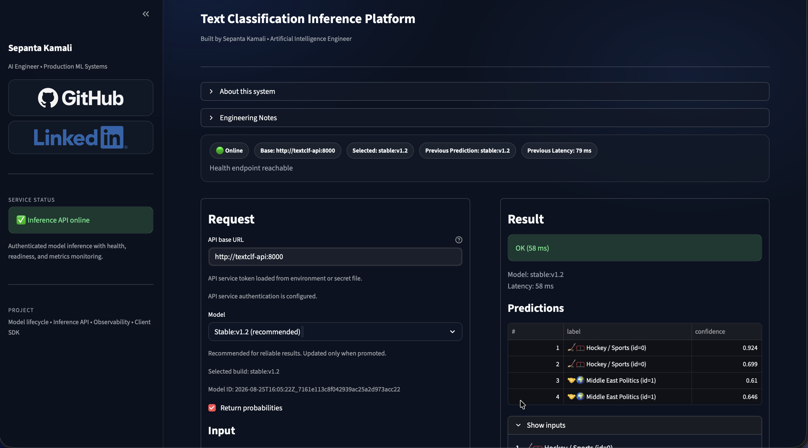
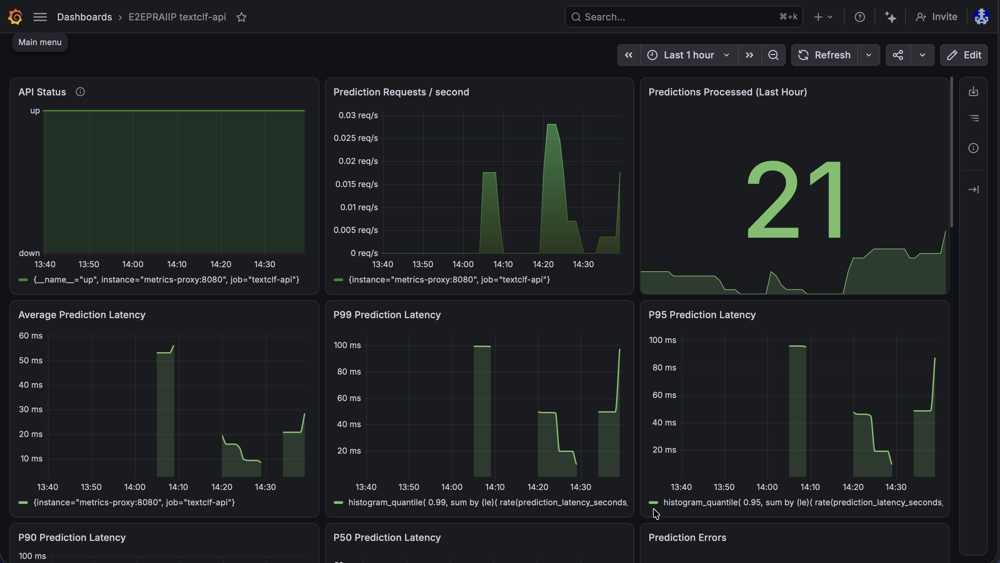
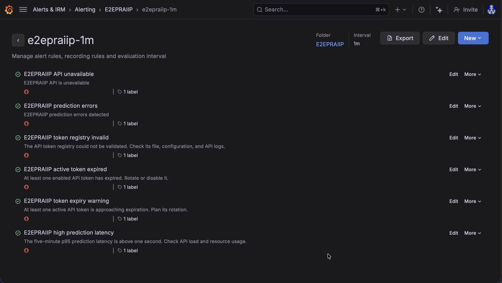
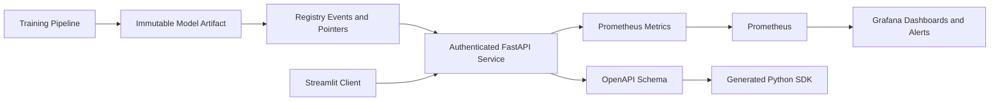

# E2EPRAIIP: Production ML Inference Platform

E2EPRAIIP is a deployed reference implementation of the engineering work needed
to move a machine-learning model beyond a notebook: reproducible artifacts,
secure inference, automated delivery, monitoring, alerting, and recovery.

The reference model is intentionally simple: a binary text classifier trained
on a subset of scikit-learn's `fetch_20newsgroups` dataset. The project's main
contribution is the surrounding production ML system, not model novelty.

> Repository: <https://github.com/sepantakamali/E2EPRAIIP>

## At a Glance

- Immutable joblib artifacts with embedded build metadata and SHA-256 identity
- Append-only registry events plus independent `latest` and `stable` pointers
- Typed FastAPI inference service with scoped bearer-token authentication
- Streamlit client supporting single, batch, and file-based predictions
- OpenAPI-generated Python SDK
- Docker Compose product and monitoring stacks
- GitHub Actions CI, multi-architecture image publishing, and deployment
- OCI Ubuntu VM deployment behind Nginx and HTTPS
- Prometheus metrics, Grafana Cloud dashboards, and six managed alert rules
- Controlled token rotation, encrypted off-VM backups, and tested restoration

## Production Demonstration

### Inference client



The client displays service health, model selection, immutable model identity,
prediction latency, labels, and confidence values without exposing credentials.

### Observability dashboard



The dashboard tracks availability, request volume, errors, latency percentiles,
process resources, token-registry health, and token expiry.

### Managed alerts



Grafana-managed rules cover API availability, prediction errors, registry
validity, expired tokens, approaching token expiry, and high prediction latency.

## System Overview



The implementation is specific to binary text classification. Its artifact,
API, security, delivery, and observability practices are designed to be adapted
to other inference projects.

## Documentation Guide

| Area | Document |
|---|---|
| Documentation index and terminology | [Documentation guide](docs/README.md) |
| Architecture and service boundaries | [Architecture](docs/architecture.md) |
| Dataset and model scope | [Model and dataset](docs/model-and-dataset.md) |
| Artifact identity, registry, promotion, and resolution | [Model lifecycle](docs/model-lifecycle.md) |
| API routes, authentication, rate limiting, UI, and SDK | [API and security](docs/api-and-security.md) |
| Local development, containers, OCI, HTTPS, backup, and recovery | [Deployment and operations](docs/deployment-and-operations.md) |
| Prometheus, Grafana dashboards, and alerting | [Observability](docs/observability.md) |
| Tests, type checking, CI/CD, and releases | [Testing and CI/CD](docs/testing-and-ci.md) |

Operational configuration also has a focused guide in
[`deploy/README.md`](deploy/README.md), while the generated client has its own
[`textclf_client/README.md`](textclf_client/README.md).

## API Surface

Operational endpoints requiring no API token (not exposed by the production web proxy):

- `GET /health`
- `GET /ready`

Authenticated application endpoints:

- `POST /predict`
- `GET /version`
- `GET /models`
- `GET /whoami`

Internal-only operational endpoints:

- `GET /health/details`
- `GET /metrics`

Application scopes are `predict:run`, `models:read`, `version:read`, and
`whoami:read`.

## Quick Start

### Local Python

```bash
python3.11 -m venv .venv
source .venv/bin/activate
pip install -e ".[dev]"
make train-save
AUTH_ENABLED=false MODEL_POINTER=latest make api
```

In another terminal:

```bash
source .venv/bin/activate
make ui
```

This loopback-only example disables authentication for local learning. Production
uses mounted token files and keeps authentication enabled. The first training run
downloads the dataset. Python 3.11 is the version used in CI.

### Docker Compose

```bash
AUTH_ENABLED=false docker compose up --build
```

Train an artifact first using the Python commands above. The basic development
stack starts the API on the host loopback interface with authentication disabled
only for this example. The product and monitoring stacks
use the focused Compose definitions under `deploy/`.

## Quality Checks

```bash
source .venv/bin/activate
pytest -q
mypy src admin
```

The suite covers data invariants, training and prediction, API behaviour,
artifact immutability, registry compatibility, promotion, publication, token
administration, rotation, rollback, and monitoring collectors.

## Repository Map

```text
admin/                 Host-side token lifecycle tooling
artifacts/             Immutable model files, registry log, and pointers
deploy/                Product and monitoring Compose definitions
docs/                  Focused project documentation and screenshots
grafana/               Dashboard JSON and managed alert-rule export
monitoring/            Prometheus configuration and alert rules
nginx/                 UI and authenticated metrics proxy configuration
scripts/               Model, token, monitoring, and Grafana utilities
src/textclf/           Data, model, artifact, registry, API, and settings code
tests/                 Automated test suite
textclf_client/        OpenAPI-generated Python SDK
ui/                    Streamlit inference client
.github/workflows/     CI, image, deployment, and dashboard automation
```

## Current State

The system has been exercised locally, on an Ubuntu Server VM, and on an OCI
Ubuntu production VM. The deployed stack uses GHCR images, host-mounted model
artifacts, Nginx with Let's Encrypt HTTPS, Prometheus remote write to Grafana
Cloud, managed alerts with email delivery, and encrypted secret backups stored
off the VM.

## Project Purpose

This repository began as implementation practice for developing production AI
engineering skills. It demonstrates how model code, runtime contracts,
deployment, security, monitoring, and recovery fit together in a working
system. The same engineering principles can be transferred to more specialised
models/projects.
