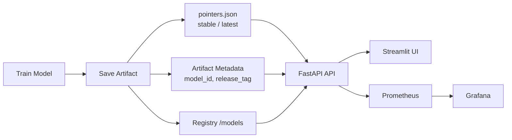

# End-to-End Production-Ready AI Inference Platform

Modern, production-style text classification service with:

- FastAPI + Pydantic v2 for a typed, OpenAPI-compliant HTTP API  
- Dockerized deployment with model versioning and promotion (latest / stable)  
- Structured logging, Prometheus metrics, and optional Grafana Cloud integration  
- Strong type safety and testing (mypy, pytest)  
- A generated Python client SDK for downstream integration

> Repository: https://github.com/sepantakamali/E2EPRAIIP

---

## Architecture

This system implements a production-style ML inference pipeline covering model lifecycle, deployment, and observability.

### Full Architecture

```mermaid
flowchart TD
    A[Training Pipeline] --> B[Build Trained Text Classifier]
    B --> C[Save Canonical Artifact<br/>artifacts/model_*.joblib]

    C --> D[Artifact Metadata<br/>model_id<br/>software_version<br/>created_at<br/>sha256<br/>published<br/>release_tag]

    C --> E[Pointer Management]
    E --> F[pointers.json]
    F --> F1[latest -> newest artifact]
    F --> F2[stable -> promoted artifact]

    C --> G[Publish / Release]
    G --> G1[Set published=True]
    G --> G2[Optional release_tag<br/>vMAJOR.MINOR]

    C --> H[Model Registry]
    H --> H1[/models endpoint]
    H --> H2[Read current artifact metadata]

    F --> I[FastAPI Inference Service]
    H --> I
    D --> I

    I --> I1[/predict]
    I --> I2[/version]
    I --> I3[/health]
    I --> I4[/models]
    I --> I5[/metrics]

    I --> J[Prometheus]
    J --> K[Grafana]

    I --> L[Streamlit Inference Console]
    L --> L1[Select stable / latest / published model]
    L --> L2[Single text / batch / file upload]
    L --> L3[Prediction results + raw JSON]
    L --> L4[Request history + CSV export]
    L --> L5[Health / Docs / Metrics links]
```

### Simplified Flow



## Features

- **FastAPI inference microservice**  
  - `/health` and `/predict` endpoints  
  - Built-in request validation (Pydantic v2)  
  - Automatic OpenAPI / Swagger docs at `/docs` and `/redoc`

- **Model versioning & promotion**  
  - Versioned artifacts stored under `artifacts/`  
  - Pointers for `latest` and `stable` models (`model_latest.joblib`, `model_stable.joblib`)  
  - CLI and helper scripts to train, save, and promote models

- **Production-style deployment**  
  - Dockerfile for building `textclf-api` images  
  - `docker-compose.yml` for running the API container with mounted artifacts  
  - `docker-compose.monitor.yml` for running Prometheus + API locally

- **Observability & rate limiting**  
  - `/metrics` endpoint with Prometheus client metrics  
  - Custom application metrics:
    - `pred_requests_total`
    - `pred_request_errors_total`
    - `pred_latency_seconds` (histogram)
  - Optional integration with Grafana Cloud via `remote_write`  
  - SlowAPI-based rate limiting on `/predict` (IP-based)

- **Quality gates**  
  - `pytest` test suite, including API tests (`tests/test_api.py`)  
  - `mypy` static type checking across `src/`  
  - Configurable logging via `logging_conf.py`

- **Client SDK**  
  - OpenAPI schema exposed at `/openapi.json`  
  - Generated Python client in `textclf_client/` for programmatic use  
  - Install locally with: `pip install -e textclf_client`
  - Example usage in `client_demo.py`

## Production deployment (Render)

A public demo deployment is available on Render:

- Current demo: https://e2epraiip.onrender.com

- Base URL: `https://e2epraiip.onrender.com`
- Health check: `GET /health`
- OpenAPI docs: `GET /docs`
- Metrics: `GET /metrics` (if exposed)

Example request:

```bash
curl -X POST "https://e2epraiip.onrender.com/predict?model=stable" \
  -H "Content-Type: application/json" \
  -d '{"texts":["Hockey fans were ecstatic after the playoff win."],"return_prob":false}'
```

---

## Tech Stack

- **Language**: Python 3.11+
- **Web Framework**: FastAPI
- **Validation**: Pydantic v2
- **Model Persistence**: joblib
- **Containerization**: Docker
- **Rate Limiting**: SlowAPI
- **Monitoring**: Prometheus, optional Grafana Cloud
- **Testing**: pytest
- **Typing**: mypy

---

## Project Structure

```text
.
├── src/
│   └── textclf/
│       ├── api.py             # FastAPI application & endpoints
│       ├── cli.py             # CLI for training/promoting models
│       ├── persistence.py     # Model save/load, runlog, promotion logic
│       ├── logging_conf.py    # Logging configuration
│       ├── predict.py         # CLI prediction tool
│       └── ...
├── monitoring/
│   ├── prometheus.yml         # Prometheus config (local + remote_write)
│   └── alerts.yml             # Example alert rules
├── tests/
│   ├── test_api.py
│   ├── test_versioning.py
│   └── test_promotion.py
├── docker-compose.yml         # Run API container
├── docker-compose.monitor.yml # Run API + Prometheus for monitoring
├── Dockerfile                 # Build textclf-api image
├── client_demo.py             # Example usage of the generated Python client
├── .env.example               # Example environment variables (no secrets)
└── README.md
# End-to-End Production-Ready AI Inference Platform

Production-oriented NLP inference platform built with FastAPI, Streamlit, Docker, Prometheus, and Grafana.

The project implements:

- ML model training and inference
- Model artifact versioning and promotion
- REST API serving
- Streamlit inference UI
- Observability and monitoring
- Dockerized deployment
- Automated testing and CI workflows

Repository:

```text
https://github.com/sepantakamali/E2EPRAIIP
```

---

# Architecture

```mermaid
flowchart TD
    A[Training Pipeline] --> B[Versioned Model Artifact]
    B --> C[Artifact Registry / Persistence]

    C --> D[pointers.json]
    D --> D1[latest]
    D --> D2[stable]

    C --> E[FastAPI Inference API]

    E --> E1[/predict]
    E --> E2[/health]
    E --> E3[/metrics]
    E --> E4[/models]
    E --> E5[/docs]

    E --> F[Prometheus]
    F --> G[Grafana]

    E --> H[Streamlit UI]

    H --> H1[Single Predictions]
    H --> H2[Batch Predictions]
    H --> H3[Request History]
    H --> H4[Model Selection]
```

---

# Current Features

## Machine Learning

- TF-IDF text vectorization
- Chi-square feature selection
- Logistic Regression classifier
- Train/inference pipeline separation
- Model metadata tracking
- Versioned model artifacts
- Stable/latest model promotion

---

## FastAPI Inference Service

Endpoints:

- `/predict`
- `/health`
- `/metrics`
- `/models`
- `/docs`
- `/redoc`
- `/openapi.json`
- `/whoami`

Features:

- Typed request/response schemas (Pydantic v2)
- Structured logging
- Request timing middleware
- Authentication support
- Internal-only endpoint protection
- Prometheus instrumentation
- OpenAPI schema generation

---

## Streamlit UI

Interactive frontend for:

- Single text prediction
- Batch prediction
- CSV upload
- Model selection (`latest` / `stable`)
- Viewing API responses
- Request history
- CSV export
- API endpoint shortcuts

---

## Observability

Monitoring stack:

- Prometheus
- Grafana
- Application metrics
- Structured logs

Metrics include:

- prediction request count
- prediction latency
- prediction errors
- CPU usage
- memory usage
- Python runtime metrics
- GC metrics
- file descriptor metrics

---

## Dockerized Deployment

### Product Stack

```text
API
UI
metrics proxy
```

### Monitoring Stack

```text
Prometheus
Grafana
```

Separate compose files are used for:

```text
Application deployment
Monitoring deployment
```

---

## Quality & Validation

- `pytest`
- `mypy`
- GitHub Actions CI
- Type-safe codebase
- Isolated persistence tests
- API smoke tests

Current status:

```text
pytest: passing
mypy: passing
```

---

# Project Structure

```text
.
├── artifacts/                  # Saved model artifacts, pointers, run logs
├── monitoring/                 # Prometheus and Grafana configuration
├── nginx/                      # Metrics proxy / reverse proxy
├── logs/                       # Application logs
├── scripts/                    # Utility scripts
├── src/
│   └── textclf/
│       ├── api.py              # FastAPI service
│       ├── persistence.py      # Artifact management and promotion
│       ├── model.py            # ML pipeline
│       ├── data.py             # Dataset loading
│       ├── metrics.py          # Prometheus metrics
│       ├── logging_conf.py     # Logging configuration
│       ├── cli.py              # CLI utilities
│       └── ...
├── tests/                      # pytest test suite
├── textclf_client/             # Generated/client SDK utilities
├── ui/                         # Streamlit frontend
├── Dockerfile
├── docker-compose.product.yml
├── docker-compose.monitor.yml
├── requirements.txt
├── pyproject.toml
├── client_demo.py
├── README.md
└── Makefile
```

---

# Docker Usage

## Product Stack

Start:

```bash
docker compose -p textclf-product -f docker-compose.product.yml up -d
```

Stop:

```bash
docker compose -p textclf-product -f docker-compose.product.yml down
```

---

## Monitoring Stack

Start:

```bash
docker compose -p textclf-monitor -f docker-compose.monitor.yml up -d
```

Stop:

```bash
docker compose -p textclf-monitor -f docker-compose.monitor.yml down
```

---

# Local Development

## Run tests

```bash
pytest
```

## Run type checking

```bash
mypy src
```

---

# API Example

```bash
curl -X POST "http://localhost:8000/predict?model=stable" \
  -H "Content-Type: application/json" \
  -d '{
    "texts": ["Hockey fans were ecstatic after the playoff win."],
    "return_probabilities": false
  }'
```

---

# Monitoring

Default local endpoints:

```text
API:        http://localhost:8000
Swagger:    http://localhost:8000/docs
UI:         http://localhost:8501
Prometheus: http://localhost:9090
Grafana:    http://localhost:3000
```

---

# CI/CD

Current GitHub Actions workflows:

```text
CI:
- pytest
- mypy

Docker:
- Build Docker image
- Push image to GHCR
```

---

# Current Status

Implemented:

- Production-style FastAPI inference service
- Streamlit frontend
- Dockerized deployment
- Prometheus + Grafana monitoring
- Model versioning and promotion
- Structured logging
- Automated tests
- GitHub Actions CI
- GHCR Docker publishing

Still planned:

- Dependency pinning cleanup
- Deployment automation
- Final CI/CD refinement
- README refinement
- Production cloud deployment