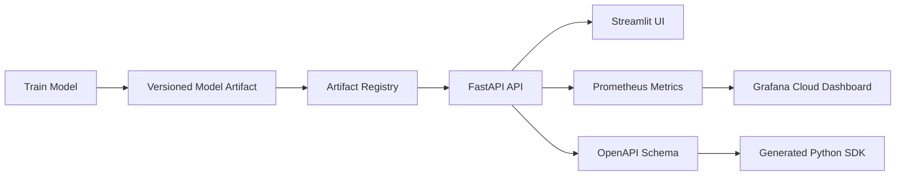
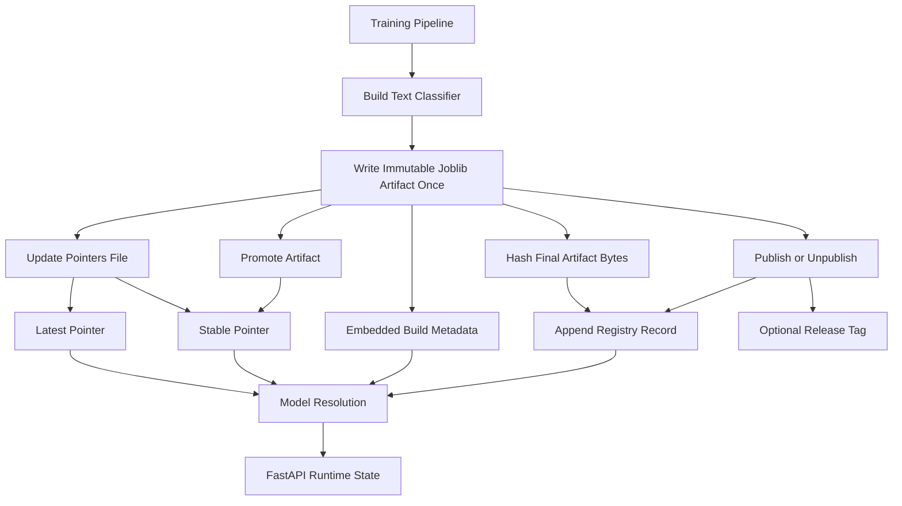
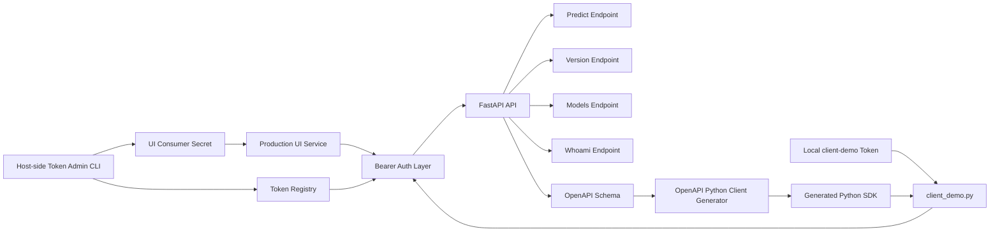
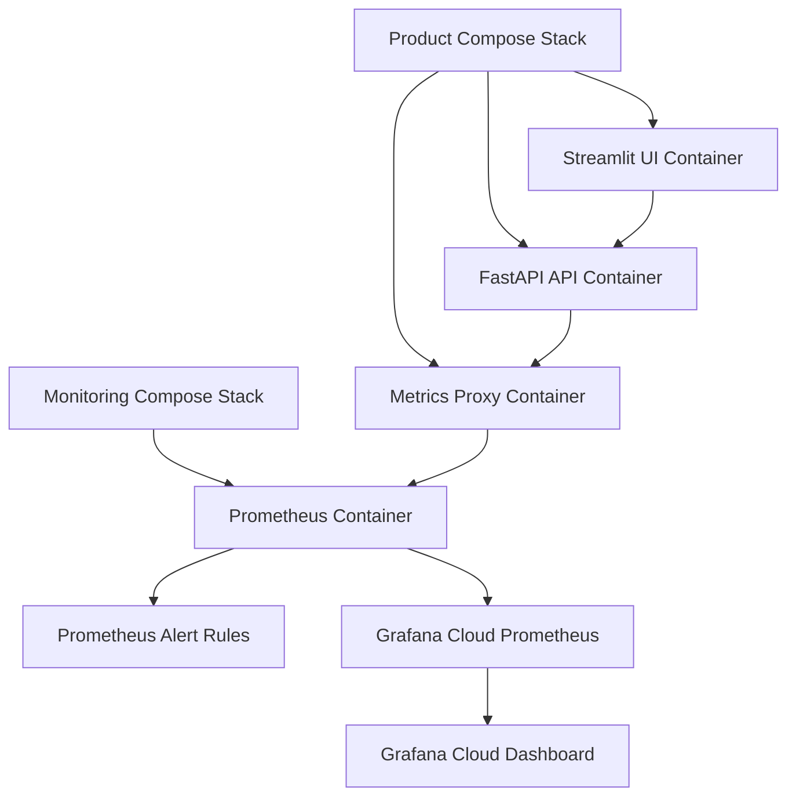

# End-to-End Production-Ready AI Inference Platform

A reusable production-ready AI inference platform demonstrating secure deployment, model serving, observability, authentication, CI/CD, and cloud-native infrastructure.

The current reference application is a text classification model served through FastAPI, but the platform is designed to host multiple AI inference workloads.

> Repository: <https://github.com/sepantakamali/E2EPRAIIP>

---

## What This Project Provides

- A trained text classification model served through a typed FastAPI API
- Versioned model artifacts with metadata, `latest`, and `stable` pointer resolution
- A Streamlit UI for local/product-style interaction with the inference service
- Bearer-token authentication with scoped service principals
- Controlled token lifecycle management with planning, verification, rotation, overlap, rollback, and audit metrics
- Encrypted off-VM secret backup and tested restore using restic and OCI Object Storage
- Prometheus metrics, local Prometheus rules, Grafana Cloud dashboards, and email alerting
- Docker Compose stacks for product and monitoring environments under `deploy/`
- A generated OpenAPI Python SDK for downstream integration
- Automated quality gates with `pytest`, `mypy`, GitHub Actions, and GHCR image publishing
- GitHub Actions workflows for CI, GHCR image publishing, product deployment, monitoring deployment, and Grafana dashboard-as-code
- HTTPS deployment with Let's Encrypt and Nginx reverse proxy

---

## Architecture

The project is easier to understand as several connected layers rather than one large diagram.

### 1. System Overview



### 2. Model Lifecycle



### 3. API, Authentication, and Client Flow



### 4. Docker and Monitoring Layout



---

## Features

### FastAPI Inference Service

Protected endpoints include:

- `POST /predict`
- `GET /version`
- `GET /models`
- `GET /whoami`

Operational endpoints include:

- `GET /health` (public liveness endpoint)
- `GET /ready` (public readiness endpoint)
- `GET /health/details` (internal diagnostics endpoint)
- `GET /metrics` (internal Prometheus endpoint)
- `GET /openapi.json` when documentation is enabled
- `GET /docs` when documentation is enabled

Main API features:

- Pydantic v2 request and response schemas
- OpenAPI schema generation
- Bearer-token authentication
- Scoped token support
- Structured request logging
- Request IDs
- Runtime model metadata reporting
- Prometheus metric instrumentation
- token expiry and revocation enforcement
- constant-time token hash comparison
- per-principal rate-limit identity
- trusted-proxy handling
- internal-only diagnostics and metrics endpoints
- authentication and authorization audit logging
- token-registry Prometheus metrics
- production API docs/OpenAPI disabled unless explicitly enabled

### Model Versioning and Promotion

The model lifecycle supports:

- versioned `.joblib` artifacts under `artifacts/`
- immutable artifact metadata including model ID, software version, creation time, and training configuration
- SHA-256 integrity records calculated from the final serialized artifact bytes
- mutable publication status and release tags stored outside the artifact
- `pointers.json` for `latest` and `stable` model resolution
- append-only lifecycle logging through `runs.model`
- model promotion by pointer update without copying or rewriting the artifact
- model selection by pointer, model ID, or artifact filename

#### Artifact and Registry Responsibilities

Each canonical `.joblib` is written once. Its `model_id` is generated independently
of its serialized bytes, avoiding the circular problem of embedding a file's own
checksum inside that file. After serialization, the final bytes are hashed and the
digest is recorded externally.

```text
artifacts/model_<timestamp>-<tag>.joblib
├── trained pipeline
├── immutable model_id
├── creation time
├── software version
└── training configuration

artifacts/runs.model
├── final artifact SHA-256
├── publication events
├── release tags
└── legacy reconciliation records

artifacts/pointers.json
├── latest
└── stable
```

`load_model()` loads the immutable artifact and then overlays the newest valid
registry state for the same `model_id`. Publishing, unpublishing, and promotion do
not change the artifact checksum.

Common lifecycle commands:

```bash
make train-save

make publish \
  ARTIFACT=artifacts/model_YYYYMMDD_HHMMSS-local.joblib \
  PUBLISH_ARGS="--release-tag v1.0"

make promote \
  ARTIFACT=artifacts/model_YYYYMMDD_HHMMSS-local.joblib

make audit-models
```

`make audit-models` is read-only. `make reconcile-models` appends an authoritative
checksum and lifecycle record for a legacy artifact without rewriting its
`.joblib` file.

#### Reference Lifecycle Validation

The completed lifecycle was exercised on 25 August 2026 with the reference
artifact `model_20260825_160522-reference.joblib`:

```text
held-out accuracy: 0.9613
minimum required:  0.9000
software version:  0.2.0
release tag:       v1.2
published:         true
artifact SHA-256:  ba82b07d67471c5be017b6c299e52eaf8e2a85d70d069ed2ac8ec1ea4a2d8fa6
latest pointer:    model_20260825_160522-reference.joblib
stable pointer:    model_20260825_160522-reference.joblib
```

The artifact hash was identical before publication and after promotion. Loading
the `stable` pointer through the FastAPI prediction path returned HTTP 200 and
reported the same model ID, software version, release tag, and publication state
used by the Streamlit UI.

### Streamlit UI

The Streamlit interface supports:

- single text prediction
- batch prediction
- file upload
- model selection
- prediction result display
- raw JSON inspection
- request history
- CSV export
- helpful links to API and monitoring endpoints

### Generated Python SDK

The SDK is generated from the FastAPI OpenAPI schema.

Generated SDK project directory:
textclf_client/

Importable generated Python package:
textclf_api_client

It provides:

- typed request models
- typed response models
- endpoint wrapper functions
- authenticated client support through `AuthenticatedClient`
- reusable integration code for external Python consumers

### Observability

Monitoring support includes:

- Prometheus scraping
- Prometheus alert rules
- Grafana Cloud dashboards provisioned from version-controlled JSON
- Grafana-managed alert rules with email notifications
- dashboard-as-code synchronized through GitHub Actions
- Prometheus `remote_write` to Grafana Cloud  
- latency percentiles
- process metrics
- runtime metrics
- token-registry validation metrics
- active-token expiry and warning metrics
- per-token days-remaining metrics
- Prometheus alerts for invalid registries and expiring/expired active tokens

### Deployment

#### Deployment Files

```text
admin/
├── manage_tokens.py
├── token_consumer.py
├── token_issuance.py
└── token_rotation.py

deploy/
├── docker-compose.product.yml
├── docker-compose.monitor.yml
└── token-principals.yml

monitoring/
├── prometheus.yml
└── alerts.yml

nginx/
├── metrics.conf
└── ui.conf

grafana/
└── dashboards/
    └── e2epraiip-overview.json

scripts/
├── audit_tokens.py
├── generate_prometheus_config.sh
├── issue_token.py
├── provision_monitoring_auth.py
├── revoke_token.py
└── sync_grafana_dashboard.sh
```

#### Deployment Capabilities

- Oracle Cloud Infrastructure (OCI) Ubuntu Server deployment
- Docker Compose orchestration
- GitHub Container Registry (GHCR) image distribution
- host-mounted model artifacts
- environment-driven model selection through MODEL_POINTER
- GitHub Actions deployment workflows
- Nginx reverse proxy with HTTPS
- Cloudflare DNS integration
- Automatic TLS certificate provisioning with Let's Encrypt
- host-side token administration tooling deployed separately from the application image
- encrypted secret backup to OCI Object Storage with restic
- daily secret backup scheduling with systemd and retention management

---

## Project Structure

```text
.
├── .github/
│   └── workflows/              # CI, Docker, product, monitoring, and Grafana workflows
├── admin/                      # Host-side token lifecycle tooling
│   ├── manage_tokens.py
│   ├── token_consumer.py
│   ├── token_issuance.py
│   └── token_rotation.py
├── artifacts/                  # Immutable models, pointers, registry, and history
├── deploy/                     # VM deployment Compose files and token principal policy
│   ├── docker-compose.product.yml
│   ├── docker-compose.monitor.yml
│   └── token-principals.yml
├── grafana/                    # Grafana Cloud observability configuration
│   ├── alerting/
│   │   └── e2epraiip-1m.yaml  # Exported Grafana-managed alert rules
│   └── dashboards/
│       └── e2epraiip-overview.json
├── monitoring/                 # Prometheus scrape and alert configuration
│   ├── prometheus.yml
│   └── alerts.yml
├── nginx/                      # Metrics proxy configuration
│   ├── metrics.conf
│   └── ui.conf
├── logs/                       # Local application log files
├── scripts/                    # Model audit, token, monitoring-auth, and utility scripts
│   ├── audit_model_registry.py
│   ├── audit_tokens.py
│   ├── generate_prometheus_config.sh
│   ├── issue_token.py
│   ├── provision_monitoring_auth.py
│   ├── revoke_token.py
│   └── sync_grafana_dashboard.sh
├── src/
│   └── textclf/
│       ├── api.py
│       ├── cli.py
│       ├── config.py
│       ├── data.py
│       ├── logging_conf.py
│       ├── model.py
│       ├── persistence.py
│       ├── token_audit.py
│       └── token_store.py
├── tests/
├── textclf_client/             # Generated SDK project/output directory
├── ui/                         # Streamlit frontend
├── Dockerfile
├── docker-compose.product.yml  # Local/product-style compose file
├── docker-compose.monitor.yml  # Local monitoring compose file
├── docker-compose.yml          # Lightweight local development compose file
├── client_demo.py
├── client_config.yaml
├── pyproject.toml
├── requirements.txt
├── Makefile
├── .env.example
└── README.md
```

---

## Authentication

Protected API routes use scoped Bearer token authentication.

### Production Service Authentication

The production Streamlit UI authenticates to FastAPI as the `ui-service` service principal.

Production token metadata is stored outside Git under:

```text
/home/deploy/textclf_secrets/tokens.json
```

The UI raw credential is stored separately at:

```text
/home/deploy/textclf_secrets/ui_api_token.txt
```

The current UI scopes are:

```text
predict:run
models:read
version:read
whoami:read
```

Token lifecycle administration is performed on the VM with:

```bash
cd /home/deploy/textclf
set -a; source .env; set +a

python3 -m admin.manage_tokens list
python3 -m admin.manage_tokens plan ui-service
python3 -m admin.manage_tokens verify ui-service
python3 -m admin.manage_tokens rotate ui-service
```

- `list` displays token registry state without exposing raw credentials.
- `plan` validates policy and displays a non-mutating rotation plan.
- `verify` verifies the credential actually mounted inside the running consumer.
- `rotate` requires administrator approval and performs controlled successor issuance, overlap, atomic secret replacement, consumer restart, health checking, credential verification, rollback on failure, finalization, and immediate encrypted backup after success.

Production principal policy is stored in:

```text
deploy/token-principals.yml
```

Raw production credentials are never stored in Git or application images.

### SDK Demo Authentication

client_demo.py is a local integration example for the generated Python SDK.

It uses the separate `client-demo` principal.

The API base URL is configured through `CLIENT_DEMO_API_BASE_URL` and defaults to:

http://127.0.0.1:8000

The raw demo token remains outside the repository and is referenced through:

```env
CLIENT_DEMO_TOKEN_FILE=../practice_sprint_secrets/client_demo_token.txt
CLIENT_DEMO_API_BASE_URL=http://127.0.0.1:8000
CLIENT_DEMO_MODEL=stable
CLIENT_DEMO_TIMEOUT_SECONDS=10
```

Load .env before running the demo:

```bash
set -a
source .env
set +a
```

The client-demo credential is a development/integration credential and is
separate from the production ui-service credential.

## Generated Python SDK

Regenerate the SDK from a running local API with documentation enabled:

```bash
openapi-python-client generate \
  --url http://127.0.0.1:8000/openapi.json \
  --overwrite \
  --output-path textclf_client
```

The generated project is stored under `textclf_client/`, while the importable package used by `client_demo.py` is `textclf_api_client`.

Run the demo client:

```bash
python client_demo.py
```

The demo client uses:

- `AuthenticatedClient`
- `PredictRequest`
- bearer token loaded from `CLIENT_DEMO_TOKEN_FILE`
- explicit model selection

```text
Model selection supports pointer names such as `stable` and `latest`, specific model IDs, or artifact filenames depending on API configuration.
```

---

## Local Development

Load environment variables:

```bash
set -a
source .env
set +a
```

Run the API locally:

```bash
SHOW_DOCS=1 INTERNAL_ONLY_ENABLED=false RATE_LIMIT_ENABLED=0 \
uvicorn textclf.api:app \
  --host 127.0.0.1 \
  --port 8000 \
  --loop asyncio \
  --reload
```

Run the Streamlit UI locally:

```bash
streamlit run ui/app.py
```

Run tests:

```bash
pytest
```

Run type checking:

```bash
mypy src admin
```

---

## Docker Usage

Start the product stack:

```bash
docker compose --env-file .env -f deploy/docker-compose.product.yml up -d
```

Start the monitoring stack:

```bash
docker compose --env-file .env -f deploy/docker-compose.monitor.yml up -d
```

Stop the product stack:

```bash
docker compose --env-file .env -f deploy/docker-compose.product.yml down
```

Stop the monitoring stack:

```bash
docker compose --env-file .env -f deploy/docker-compose.monitor.yml down
```

The public entry point is an Nginx reverse proxy serving https://<DOMAIN> over ports 80 and 443. Streamlit, FastAPI, Prometheus, and the metrics proxy communicate only over internal Docker networks.

In this deployment:

- `/health` and `/ready` are public operational endpoints.
- `/health/details` and `/metrics` remain internal-only.
- `/predict`, `/version`, `/models`, and `/whoami` require Bearer authentication.

---

### Reverse Proxy

The platform uses Nginx as the single public entry point.

Features include:

- TLS termination
- Let's Encrypt certificates
- HTTP→HTTPS redirect
- HTTP/2
- Reverse proxying
- Internal Docker networking

## Monitoring

Typical deployed endpoints:

```text
Public UI:
https://<DOMAIN>

Prometheus:
localhost only

Grafana:
Grafana Cloud
```
Prometheus runs locally on the VM, evaluates its local rules, and forwards metrics
to Grafana Cloud using `remote_write`. Grafana Cloud separately evaluates the
managed alert rules and sends notifications through the `E2EPRAIIP` contact
point.

When running the API directly outside Docker, these are also available if docs are enabled:

```text
API:          http://127.0.0.1:8000
Swagger Docs: http://127.0.0.1:8000/docs
OpenAPI JSON: http://127.0.0.1:8000/openapi.json
```

Useful Prometheus queries:

```promql
up{job="textclf-api"}
```

```promql
prediction_requests_total{job="textclf-api"}
```

```promql
sum(rate(prediction_requests_total{job="textclf-api"}[5m]))
```

```promql
histogram_quantile(
  0.95,
  sum(rate(prediction_latency_seconds_bucket{job="textclf-api"}[5m])) by (le)
)
```

Token lifecycle metrics include:

textclf_token_registry_valid
textclf_token_active_expired_total
textclf_token_active_warning_total
textclf_token_days_remaining

### Dashboard

The Grafana Cloud dashboard includes:

- API availability
- Requests per second
- Predictions served (last hour)
- Prediction error count
- Prediction error rate
- P05, P50, P95 and P99 latency
- CPU usage
- API memory usage (RSS)
- Open file descriptors
- Python garbage collection activity

### Grafana-managed alerts

The Grafana Cloud alert-rule export is version-controlled at
`grafana/alerting/e2epraiip-1m.yaml`. Its six rules cover API availability,
prediction errors, token-registry validity, expired and expiring active tokens,
and p95 prediction latency. Grafana evaluates them every minute and sends email
notifications through the `E2EPRAIIP` contact point. Import this file through
Grafana Alerting when restoring the alert group in another stack.
Create the `E2EPRAIIP` contact point before importing because the export refers
to that receiver by name and does not contain its credentials.

---

## API Example

Example authenticated request:

```bash
set -a
source .env
set +a

TOKEN="$(cat "$CLIENT_DEMO_TOKEN_FILE")"

curl -X POST "http://127.0.0.1:8000/predict?model=stable" \
  -H "Authorization: Bearer ${TOKEN}" \
  -H "Content-Type: application/json" \
  -d '{
    "texts": ["Hockey fans were ecstatic after the playoff win."],
    "return_probabilities": false
  }'
```

---

## Testing

Current tests cover:

- API smoke path with isolated temporary model artifacts
- dataset loading and split invariants
- model training and prediction
- artifact save/load/versioning behavior
- promotion behavior
- immutable publication and external registry overlays
- release-tag uniqueness and controlled version jumps
- malformed and legacy registry compatibility
- token-registry auditing
- token audit Prometheus metric collection
- token issuance and replacement semantics
- token rotation planning and policy validation
- overlap handling and finalization
- rollback behavior
- atomic consumer-secret installation
- administrator approval and cancellation
- administrator scope, TTL, and overlap overrides

Run all quality checks:

```bash
pytest
mypy src admin
```

---

## CI/CD

GitHub Actions currently provide:

- CI workflow:
  - dependency installation
  - `mypy src admin`
  - `pytest -q`
- Docker workflow:
  - Multi-architecture Docker build (`linux/amd64`, `linux/arm64`)
  - GHCR authentication
  - Image publishing to GitHub Container Registry
  - Image tagging (`latest`, `main`, `sha-<commit>`)
  - GitHub Actions build cache reuse
- Product deployment workflow
- Monitoring deployment workflow
- Grafana deployment workflow

Implemented:

- GitHub Actions CI
- Multi-architecture Docker image publishing
- GHCR image registry
- Automated product deployment
- Automated monitoring deployment
- Automated Grafana Cloud dashboard synchronization
- Oracle Cloud Infrastructure deployment
- Docker Compose deployment
- SSH-based server administration
- scoped service-token monitoring and alerting
- administrator-approved token rotation with rollback
- host-side token administration tooling deployed separately from application images
- consumer credential verification after rotation
- encrypted OCI Object Storage secret backups using restic
- tested secret restore procedure
- daily systemd secret backup scheduling
- automatic post-rotation backup

Remaining:

- Infrastructure as Code (Terraform)
- final production validation and release/documentation review


## Deployment

### Deployment Journey

The deployment process was developed incrementally:

1. Local development using Uvicorn.
2. Containerized execution with Docker Compose.
3. Validation on a local Ubuntu Server virtual machine.
4. Production deployment to an Oracle Cloud Infrastructure virtual machine.
5. GitHub Container Registry (GHCR) for image distribution.
6. Automated product deployment through GitHub Actions.
7. Automated monitoring deployment through GitHub Actions.
8. Automated Grafana Cloud dashboard synchronization.

### Container Registry

Application images are published automatically to GitHub Container Registry (GHCR).

Published tags include:

```text
latest
main
sha-<commit>
```

Multi-architecture images are built for:

```text
linux/amd64
linux/arm64
```

allowing deployment on both x86_64 and ARM64 systems.

### Docker Compose Deployment

A production-style deployment can be performed using Docker Compose.

Example deployment layout:

```text
/home/deploy/textclf
├── .env
├── admin/
├── artifacts/
├── deploy/
│   ├── docker-compose.product.yml
│   ├── docker-compose.monitor.yml
│   └── token-principals.yml
├── monitoring/
│   ├── prometheus.yml
│   └── alerts.yml
├── nginx/
│   ├── metrics.conf
│   └── ui.conf
└── logs/

/home/deploy/textclf_secrets
├── tokens.json
├── ui_api_token.txt
├── metrics.htpasswd
├── prometheus_metrics_password.txt
├── gc_prom_username.txt
├── gc_prom_password.txt
├── gc_prom_url.txt
└── grafana_admin_password.txt

/home/deploy/.config/textclf-backup
├── restic.env
├── restic-password
├── aws-access-key
└── aws-secret-key
```

The deployment stack uses:

- GHCR-hosted container images
- Docker Engine
- Docker Compose orchestration
- host-mounted model artifacts
- environment-driven model selection through `MODEL_POINTER`
- Oracle Cloud Infrastructure (OCI) VM running Ubuntu Server 24.04 LTS
- SSH key authentication


### Model Artifact Deployment

Model artifacts are intentionally stored outside the application image.

Artifacts are mounted from the host:

```text
Host: /home/deploy/textclf/artifacts
Container: /app/artifacts
```

Benefits:

- model updates do not require image rebuilds
- stable/latest promotion remains independent from application releases
- multiple model versions can coexist on the deployment host

### Secret Backup and Recovery

Production secrets under `/home/deploy/textclf_secrets/` are mutable runtime state and are deliberately independent from Git, Docker images, and deployment synchronization.

Encrypted backups are created with restic and stored in OCI Object Storage with object versioning enabled.

Backup configuration and credentials are stored separately under:

/home/deploy/.config/textclf-backup/

On-demand backup:

cd /home/deploy/textclf
./admin/backup_secrets.sh

Retention policy:
- 7 daily recovery points
- 4 weekly recovery points
- 6 monthly recovery points

A systemd timer performs daily backups. Successful service-token rotation also triggers an immediate backup.

Timer status:
systemctl list-timers textclf-secrets-backup.timer

Backup service status:
systemctl status textclf-secrets-backup.service

Restore operations are staged first:

cd /home/deploy/textclf
./admin/restore_secrets.sh

Restored data is verified before an administrator deliberately replaces production secret state. The restore path has been tested successfully against the encrypted OCI repository.

### Local VM Deployment

Before moving to Oracle Cloud Infrastructure, the deployment flow was validated on a local Ubuntu Server VM.

The local VM stage verified:

- SSH-based administration from macOS
- Docker Engine installation
- Docker group configuration for non-root container management
- Docker Compose deployment
- GHCR authentication and image pulls
- host-mounted artifact persistence
- runtime model resolution through `MODEL_POINTER`
- local health checks against the FastAPI container

This stage provided a safe environment for learning the deployment mechanics before reproducing the same pattern on a public cloud VM.

### Oracle Cloud Infrastructure Deployment

The current public deployment runs on an Oracle Cloud Infrastructure VM with Ubuntu Server 24.04 LTS.

The cloud deployment includes:

- OCI Virtual Cloud Network (VCN)
- public subnet
- Internet Gateway
- Security List ingress rules for SSH (22), HTTP (80), and HTTPS (443)
- Prometheus bound to localhost
- FastAPI accessible only within the Docker network
- Streamlit served internally behind the Nginx reverse proxy
- public IPv4 address
- SSH key authentication
- Docker Engine and Docker Compose
- GHCR-authenticated image pulls
- host-mounted model artifacts
- Grafana Cloud used for dashboards
- Nginx reverse proxy serving the application over HTTPS

The deployed application is publicly available through https://<DOMAIN>. Nginx terminates TLS and forwards requests to the internal Streamlit service. FastAPI remains internal to the Docker network and is accessed only by trusted services.

### Deployment Validation

Verify the public Streamlit UI is reachable:

```bash
curl -I https://<DOMAIN>
```

Expected result: HTTP/2 200

```bash
curl -I http://<DOMAIN>.com
```

Expected result: 

```json
301 Moved Permanently
Location: https://<DOMAIN>/
```

Verify the FastAPI service from inside the API container:

```text
docker exec textclf-api python -c "import urllib.request; print(urllib.request.urlopen('http://127.0.0.1:8000/health').read().decode())"
```

Expected response:

```json
{
  "status": "ok"
}
```

Verify Prometheus is running:

```bash
curl -fsS http://127.0.0.1:9090/-/ready
```

Expected output: Prometheus Server is Ready.

Verify Prometheus can scrape the API metrics target:

```bash
curl -s http://127.0.0.1:9090/api/v1/targets | grep -o '"health":"[^"]*"'
```

Expected output:

```json
"health":"up"
```

```bash
cd /home/deploy/textclf
set -a
source .env
set +a

python3 -m admin.manage_tokens verify ui-service
```

Expected: Consumer verification passed: ui-service

```bash
python3 -m admin.manage_tokens list
systemctl status textclf-secrets-backup.timer
```


The public application is served through Nginx over HTTPS at https://<DOMAIN>.

FastAPI, Streamlit, Prometheus, and the metrics proxy communicate over internal Docker networks. Only Nginx is exposed publicly.

The `/health` endpoint is used for internal container and deployment checks. Runtime diagnostics, model metadata, and metrics are restricted to internal access and should not be exposed publicly.

### Ubuntu Server Validation

The deployment workflow has been validated on both a local Ubuntu Server VM and an Oracle Cloud Infrastructure Ubuntu Server VM.

Validated components:

- Docker Engine
- Docker Compose
- SSH key authentication
- GHCR authentication and image pulls
- Multi-architecture image publishing (`linux/amd64`, `linux/arm64`)
- Docker Compose deployment
- Host-mounted model artifacts
- Runtime model resolution through `MODEL_POINTER`
- Health endpoint verification
- Oracle Cloud Infrastructure networking (VCN, subnet, Internet Gateway, Security Lists)
- Public HTTPS access through Nginx
- Prometheus bound to localhost
- Docker group configuration for non-root container management
- scoped Bearer authentication
- token-registry auditing
- token rotation with controlled overlap and rollback
- consumer-secret replacement and verification
- protected host secret permissions
- encrypted OCI secret backup
- successful staged restore from backup
- systemd backup scheduling

Validated deployment flow:

```text
GitHub Actions
↓
GHCR
↓
Ubuntu Server
↓
Docker Compose
↓
FastAPI + Streamlit + Prometheus
↓
Grafana Cloud
```

### Deployment Status

Implemented:

- Automated product deployment
- Automated monitoring deployment
- Automated Grafana Cloud dashboard synchronization
- Multi-architecture Docker image publishing to GHCR through GitHub Actions
- Docker Compose deployment
- Oracle Cloud Infrastructure deployment
- Host-mounted model artifacts
- health, readiness, and internal diagnostics endpoints
- Prometheus scraping and alert rules
- Grafana Cloud dashboards through remote_write
- scoped service-token authentication and authorization
- token audit metrics and expiry/validation alerts
- administrator-approved token rotation with overlap and rollback
- consumer verification using the mounted service credential
- protected production secret permissions
- encrypted OCI Object Storage backups using restic
- tested secret restore
- daily systemd secret backup
- immediate post-rotation secret backup

Remaining:

- Infrastructure as Code (Terraform)
- final production validation and release/documentation review

### Production Deployment

```text
GitHub
   │
   ▼
GitHub Actions
   │
   ▼
GitHub Container Registry (GHCR)
   │
   ▼
Oracle Cloud Infrastructure
        │
        ▼
Ubuntu Server
        │
        ▼
Docker Compose
        │
        ▼
+-------------------------------+
| Streamlit                     |
| FastAPI                       |
| Metrics Proxy                 |
| Prometheus                    |
+-------------------------------+
        │                     │
        │                     ▼
        │               Grafana Cloud
        ▼
Host-mounted Artifacts
```

```text
Internet
   │
   ▼
Cloudflare DNS
   │
   ▼
<DOMAIN>.com
   │
   ▼
Nginx
   │
   ▼
Streamlit
   │
   ▼
FastAPI
   │
   ▼
Metrics Proxy
   │
   ▼
Prometheus
   │
   ▼
Grafana Cloud
```

## Dependency Management

Dependency management uses a two-layer approach:

- `pyproject.toml` defines project and development dependencies
- `requirements.txt` pins runtime dependency versions for reproducible local, Docker, and CI environments

Install runtime dependencies:

```bash
pip install -r requirements.txt
```

Install the project in editable mode:

```bash
pip install -e .
```

Runtime dependencies are pinned in `requirements.txt` and used by:

- local development environments
- Docker image builds
- GitHub Actions workflows
- deployment environments

This provides reproducible builds across development, CI, and deployment targets.

---

## Current Status

Implemented:

- FastAPI inference API with typed request/response schemas
- token-based authentication with scoped access
- generated Python SDK
- Streamlit UI
- model versioning, promotion, artifact metadata, and pointer resolution
- Docker product and monitoring stacks
- Prometheus monitoring with alert rules and Grafana Cloud dashboards
- dashboard-as-code deployment through GitHub Actions
- structured logging
- pytest and mypy quality gates
- GitHub Actions workflows for CI, GHCR image publishing, product deployment, monitoring deployment, and Grafana dashboard synchronization
- multi-architecture container publishing (`amd64`, `arm64`)
- Oracle Cloud Infrastructure deployment on Ubuntu Server
- health, readiness, and internal diagnostics endpoints
- host-mounted model artifact storage
- scoped service-token lifecycle management and authorization
- token registry auditing and Prometheus expiry/validation metrics
- Prometheus alerts for invalid, expiring, and expired token state
- administrator-approved token rotation with controlled overlap
- consumer restart, health wait, mounted-token verification, and rollback
- production secret permissions aligned with service access requirements
- encrypted off-VM secret backups to OCI Object Storage
- successfully tested secret restore
- daily systemd backup scheduling with retention management
- immediate backup after successful token rotation

Remaining work:

- Infrastructure as Code (Terraform)
- final production validation and release/documentation cleanup
