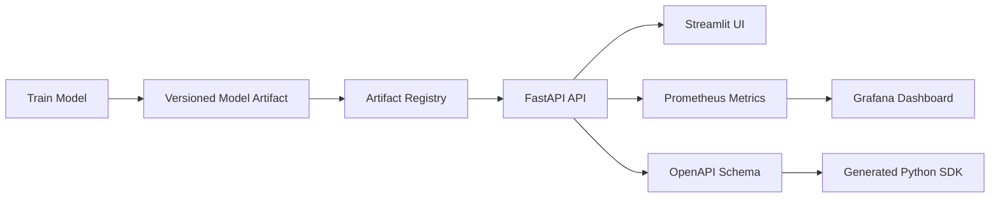
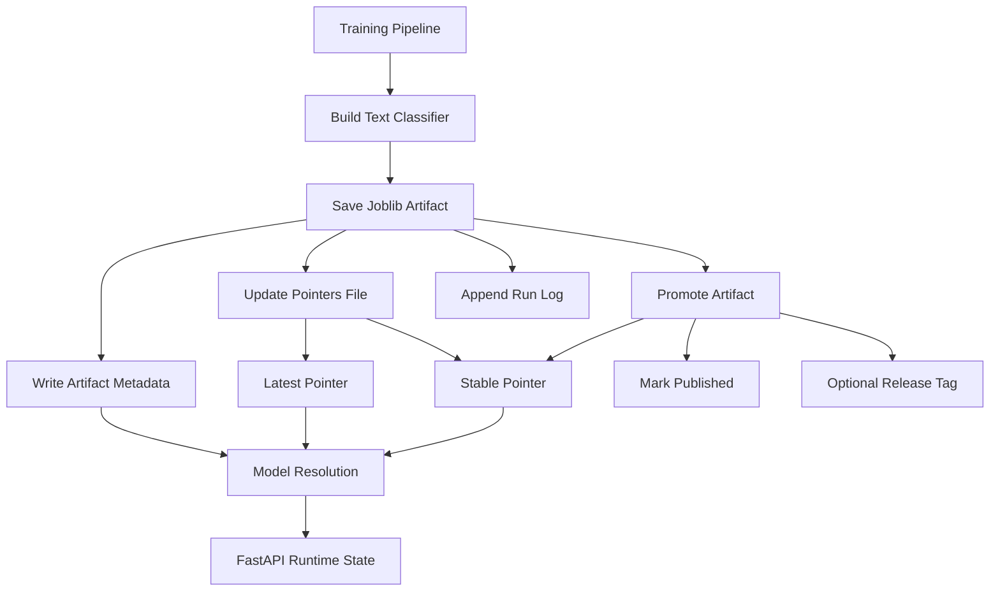
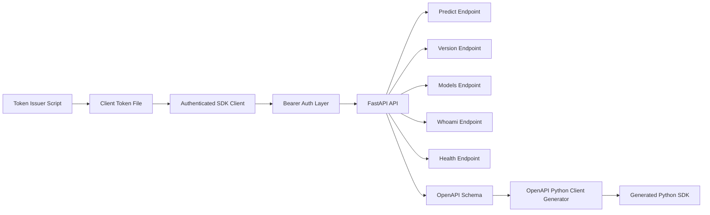
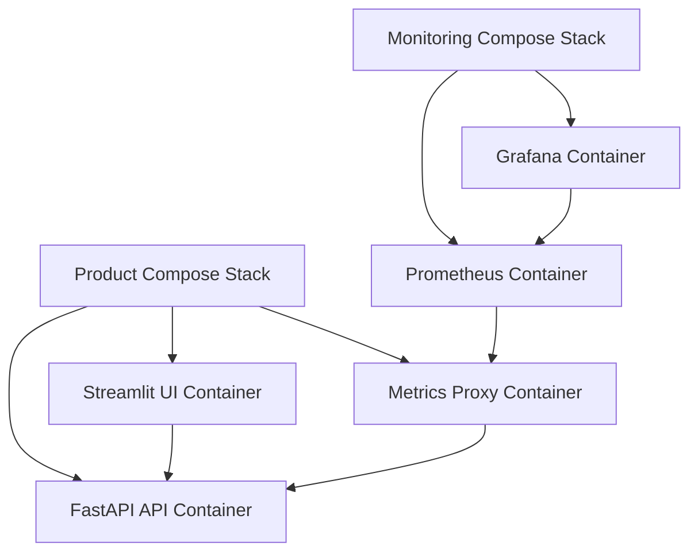

# End-to-End Production-Ready AI Inference Platform

Modern text classification inference platform with a FastAPI backend, Streamlit UI, model artifact versioning, token-based authentication, Docker deployment, Prometheus/Grafana monitoring, and a generated Python SDK.

> Repository: <https://github.com/sepantakamali/E2EPRAIIP>

---

## What This Project Provides

- A trained text classification model served through a typed FastAPI API
- Versioned model artifacts with metadata, `latest`, and `stable` pointer resolution
- A Streamlit UI for local/product-style interaction with the inference service
- Bearer-token authentication with scoped tokens
- Prometheus metrics and Grafana dashboards for operational monitoring
- Docker Compose stacks for product and monitoring environments
- A generated OpenAPI Python SDK for downstream integration
- Automated quality gates with `pytest`, `mypy`, GitHub Actions, and GHCR image publishing

---

## Architecture

The project is easier to understand as several connected layers rather than one large diagram.

### 1. System Overview



### 2. Model Lifecycle



### 3. API, Authentication, and Client Flow



### 4. Docker and Monitoring Layout



---

## Features

### FastAPI Inference Service

Protected endpoints include:

- `POST /predict`
- `GET /version`
- `GET /models`
- `GET /whoami`

Operational endpoints include:

- `GET /health` (public liveness endpoint)
- `GET /ready` (public readiness endpoint)
- `GET /health/details` (internal diagnostics endpoint)
- `GET /metrics` (internal Prometheus endpoint)
- `GET /openapi.json` when documentation is enabled
- `GET /docs` when documentation is enabled

Main API features:

- Pydantic v2 request and response schemas
- OpenAPI schema generation
- Bearer-token authentication
- Scoped token support
- Structured request logging
- Request IDs
- Runtime model metadata reporting
- Prometheus metric instrumentation

### Model Versioning and Promotion

The model lifecycle supports:

- versioned `.joblib` artifacts under `artifacts/`
- artifact metadata including model ID, software version, creation time, hash, publication status, and release tag
- `pointers.json` for `latest` and `stable` model resolution
- run logging through `runs.model`
- model promotion from candidate artifact to stable artifact
- model selection by pointer, model ID, or artifact filename

### Streamlit UI

The Streamlit interface supports:

- single text prediction
- batch prediction
- file upload
- model selection
- prediction result display
- raw JSON inspection
- request history
- CSV export
- helpful links to API and monitoring endpoints

### Generated Python SDK

The SDK is generated from the FastAPI OpenAPI schema and lives under:

```text
textclf_client/
```

It provides:

- typed request models
- typed response models
- endpoint wrapper functions
- authenticated client support through `AuthenticatedClient`
- reusable integration code for external Python consumers

### Observability

Monitoring support includes:

- Prometheus scraping
- Grafana dashboards
- prediction request counters
- prediction error counters
- prediction latency histograms
- process CPU and memory metrics
- Python runtime metrics
- file descriptor metrics
- structured application logs

### Deployment

Current deployment-related files:

- `Dockerfile` for building the application image
- `docker-compose.product.yml` for the product stack
- `docker-compose.monitor.yml` for the monitoring stack
- `docker-compose.yml` as a lightweight local development compose setup
- GitHub Actions workflow for tests and type checking
- GitHub Actions workflow for Docker image publishing to GHCR
- Oracle Cloud Infrastructure (OCI) Ubuntu Server deployment
- Public IP with SSH key authentication
- GitHub Container Registry (GHCR) image distribution
- Docker Compose orchestration
- host-mounted model artifacts
- environment-driven model selection through MODEL_POINTER

---

## Project Structure

```text
.
├── artifacts/                  # Model artifacts, pointers, and run logs
├── monitoring/                 # Prometheus and Grafana configuration
├── nginx/                      # Metrics proxy configuration
├── logs/                       # Local application log files
├── scripts/                    # Token, setup, and utility scripts
├── src/
│   └── textclf/
│       ├── api.py              # FastAPI app, routes, auth integration, runtime state
│       ├── cli.py              # CLI utilities for model operations
│       ├── config.py           # Project configuration defaults
│       ├── data.py             # Dataset loading and train/test splitting
│       ├── logging_conf.py     # Logging configuration
│       ├── model.py            # ML pipeline construction and prediction helpers
│       ├── persistence.py      # Save/load, metadata, pointers, promotion logic
│       └── ...
├── tests/                      # pytest test suite
├── textclf_client/             # Generated Python SDK package
├── ui/                         # Streamlit frontend
├── Dockerfile
├── docker-compose.product.yml
├── docker-compose.monitor.yml
├── docker-compose.yml
├── client_demo.py              # Example SDK consumer
├── client_config.yaml          # Client-side configuration example
├── pyproject.toml
├── requirements.txt
├── Makefile
├── .env.example
└── README.md
```

---

## Authentication

Protected routes use Bearer token authentication.

Tokens are issued with:

```bash
python scripts/issue_token.py \
  --subject client-demo \
  --client-id client-demo \
  --scopes predict:run version:read whoami:read health:read \
  --rotation-group client-demo
```

```text
Available scopes can be listed with:
```

```bash
python scripts/issue_token.py --list-scopes
```

```text
Token rotation supports either explicit replacement with `--replaces <token-id>` or automatic replacement of the newest active token in a rotation group using `--replace-latest`.
```

The raw token should be stored outside the repository. For the demo client, the token path is configured through:

```env
CLIENT_DEMO_TOKEN_FILE=../practice_sprint_secrets/client_demo_token.txt
```

Before running local scripts that depend on `.env`, load environment variables:

```bash
set -a
source .env
set +a
```

---

## Generated Python SDK

Regenerate the SDK from a running local API with documentation enabled:

```bash
openapi-python-client generate \
  --url http://127.0.0.1:8000/openapi.json \
  --overwrite \
  --output-path textclf_client
```

Run the demo client:

```bash
python client_demo.py
```

The demo client uses:

- `AuthenticatedClient`
- `PredictRequest`
- bearer token loaded from `CLIENT_DEMO_TOKEN_FILE`
- explicit model selection

```text
Model selection supports pointer names such as `stable` and `latest`, specific model IDs, or artifact filenames depending on API configuration.
```

---

## Local Development

Load environment variables:

```bash
set -a
source .env
set +a
```

Run the API locally:

```bash
SHOW_DOCS=1 INTERNAL_ONLY_ENABLED=false RATE_LIMIT_ENABLED=0 \
uvicorn textclf.api:app \
  --host 127.0.0.1 \
  --port 8000 \
  --loop asyncio \
  --reload
```

Run the Streamlit UI locally:

```bash
streamlit run ui/app.py
```

Run tests:

```bash
pytest
```

Run type checking:

```bash
mypy src
```

---

## Docker Usage

Start the product stack:

```bash
docker compose -p textclf-product -f docker-compose.product.yml up -d
```

Start the monitoring stack:

```bash
docker compose -p textclf-monitor -f docker-compose.monitor.yml up -d
```

Stop the product stack:

```bash
docker compose -p textclf-product -f docker-compose.product.yml down
```

Stop the monitoring stack:

```bash
docker compose -p textclf-monitor -f docker-compose.monitor.yml down
```

The product stack exposes the UI to the host. In local Docker Compose deployments, the API remains internal to the Docker network while the UI and monitoring services are exposed.

The Oracle Cloud Infrastructure deployment uses a VM-level deployment where the FastAPI container is exposed on port `8000`. In this deployment:

- `/health` and `/ready` are public operational endpoints.
- `/health/details` and `/metrics` remain internal-only.
- `/predict`, `/version`, `/models`, and `/whoami` require Bearer authentication.

---

## Monitoring

Typical local endpoints:

```text
Streamlit UI: http://localhost:8501
Prometheus:   http://localhost:9090
Grafana:      http://localhost:3000
```

When running the API directly outside Docker, these are also available if docs are enabled:

```text
API:          http://127.0.0.1:8000
Swagger Docs: http://127.0.0.1:8000/docs
OpenAPI JSON: http://127.0.0.1:8000/openapi.json
```

Useful Prometheus queries:

```promql
up{job="textclf-api"}
```

```promql
prediction_requests_total{job="textclf-api"}
```

```promql
sum(rate(prediction_requests_total{job="textclf-api"}[5m]))
```

```promql
histogram_quantile(
  0.95,
  sum(rate(prediction_latency_seconds_bucket{job="textclf-api"}[5m])) by (le)
)
```

---

## API Example

Example authenticated request:

```bash
TOKEN="$(cat ../practice_sprint_secrets/client_demo_token.txt)"

curl -X POST "http://127.0.0.1:8000/predict?model=stable" \
  -H "Authorization: Bearer ${TOKEN}" \
  -H "Content-Type: application/json" \
  -d '{
    "texts": ["Hockey fans were ecstatic after the playoff win."],
    "return_probabilities": false
  }'
```

---

## Testing

Current tests cover:

- API smoke path with isolated temporary model artifacts
- dataset loading and split invariants
- model training and prediction
- artifact save/load/versioning behavior
- promotion behavior

Run all quality checks:

```bash
pytest
mypy src
```

---

## CI/CD

GitHub Actions currently provide:

- CI workflow:
  - dependency installation
  - `mypy src`
  - `pytest -q`
- Docker workflow:
  - Multi-architecture Docker build (`linux/amd64`, `linux/arm64`)
  - GHCR authentication
  - Image publishing to GitHub Container Registry
  - Image tagging (`latest`, `main`, `sha-<commit>`)
  - GitHub Actions build cache reuse


Implemented:
- GitHub Actions CI
- Multi-architecture Docker image publishing
- GHCR image registry
- Production deployment to Oracle Cloud Infrastructure Ubuntu Server
- Docker Compose-based deployment
- SSH-based server administration

Remaining:
- Automated CD (GitHub Actions → SSH → docker compose pull && docker compose up -d)
- DNS configuration
- HTTPS (Let's Encrypt)
- Infrastructure as Code (Terraform)


## Deployment

### Deployment Journey

The deployment process was developed incrementally:

1. Local development using Uvicorn.
2. Containerized execution with Docker Compose.
3. Validation on a local Ubuntu Server virtual machine.
4. Production deployment to an Oracle Cloud Infrastructure virtual machine.
5. GitHub Container Registry (GHCR) for image distribution.
6. (Planned) Automated deployment through GitHub Actions.

### Container Registry

Application images are published automatically to GitHub Container Registry (GHCR).

Published tags include:

```text
latest
main
sha-<commit>
```

Multi-architecture images are built for:

```text
linux/amd64
linux/arm64
```

allowing deployment on both x86_64 and ARM64 systems.

### Docker Compose Deployment

A production-style deployment can be performed using Docker Compose.

Example deployment layout:

```text
/home/<user>/textclf
├── docker-compose.yml
└── artifacts/
```

The deployment stack uses:

- GHCR-hosted container images
- Docker Engine
- Docker Compose orchestration
- host-mounted model artifacts
- environment-driven model selection through `MODEL_POINTER`
- Oracle Cloud Infrastructure (OCI) VM running Ubuntu Server 24.04 LTS
- SSH key authentication


### Model Artifact Deployment

Model artifacts are intentionally stored outside the application image.

Artifacts are mounted from the host:

```text
Host:      /home/<user>/textclf/artifacts
Container: /app/artifacts
```

Benefits:

- model updates do not require image rebuilds
- stable/latest promotion remains independent from application releases
- multiple model versions can coexist on the deployment host

### Local VM Deployment

Before moving to Oracle Cloud Infrastructure, the deployment flow was validated on a local Ubuntu Server VM.

The local VM stage verified:

- SSH-based administration from macOS
- Docker Engine installation
- Docker group configuration for non-root container management
- Docker Compose deployment
- GHCR authentication and image pulls
- host-mounted artifact persistence
- runtime model resolution through `MODEL_POINTER`
- local health checks against the FastAPI container

This stage provided a safe environment for learning the deployment mechanics before reproducing the same pattern on a public cloud VM.

### Oracle Cloud Infrastructure Deployment

The current public deployment runs on an Oracle Cloud Infrastructure VM with Ubuntu Server 24.04 LTS.

The cloud deployment includes:

- OCI Virtual Cloud Network (VCN)
- public subnet
- Internet Gateway
- Security List ingress rules for SSH and API access
- public IPv4 address
- SSH key authentication
- Docker Engine and Docker Compose
- GHCR-authenticated image pulls
- host-mounted model artifacts
- FastAPI container exposed on port `8000`

The deployed API is reachable through the VM public IP. Public exposure is limited by endpoint design: liveness and readiness are public, prediction endpoints require Bearer authentication, and diagnostics plus metrics remain internal-only.

### Deployment Validation

Verify deployment health:

```bash
curl http://<host>:8000/health
```

Expected response:

```json
{
  "status": "ok"
}
```

`/health` is intentionally a minimal public endpoint used for liveness checks by deployment infrastructure and uptime monitors. Runtime diagnostics, model metadata, and application version information are available through `/health/details`, which is restricted to internal requests.

External clients should not be able to access the diagnostics endpoint.

```bash
curl http://<host>:8000/health/details
```

Expected:

```json
{
  "detail": "Internal access only"
}
```

### Ubuntu Server Validation

The deployment workflow has been validated on both a local Ubuntu Server VM and an Oracle Cloud Infrastructure Ubuntu Server VM.

Validated components:

- Docker Engine
- Docker Compose
- SSH key authentication
- GHCR authentication and image pulls
- Multi-architecture image publishing (`linux/amd64`, `linux/arm64`)
- Docker Compose deployment
- Host-mounted model artifacts
- Runtime model resolution through `MODEL_POINTER`
- Health endpoint verification
- Oracle Cloud Infrastructure networking (VCN, subnet, Internet Gateway, Security Lists)
- Public API accessibility through OCI ingress rules
- Docker group configuration for non-root container management

Validated deployment flow:

```text
GitHub Actions
↓
GHCR
↓
Ubuntu Server
↓
Docker Compose
↓
FastAPI Container
```

### Current Deployment Status

Implemented:

- Docker image publishing through GitHub Actions
- Multi-architecture image builds
- GHCR-based image distribution
- Docker Compose deployment
- SSH-based server administration
- External model artifact mounting
- Oracle Cloud Infrastructure (OCI) deployment
- Public health endpoint
- Internal diagnostics endpoint
- Public API deployment validation

Remaining:

- Automated deployment from GitHub Actions
- DNS
- HTTPS (Let's Encrypt)
- Cloud hardening

### Production Deployment

```text
GitHub
   │
   ▼
GitHub Actions
   │
   ▼
GitHub Container Registry (GHCR)
   │
   ▼
Oracle Cloud Infrastructure
        │
        ▼
Ubuntu Server
        │
        ▼
Docker Compose
        │
        ▼
+-------------------------------+
| FastAPI                       |
| Streamlit                     |
| Metrics Proxy                 |
+-------------------------------+
        │
        ▼
Host-mounted Artifacts
```

## Dependency Management

Dependency management uses a two-layer approach:

- `pyproject.toml` defines project and development dependencies
- `requirements.txt` pins runtime dependency versions for reproducible local, Docker, and CI environments

Install runtime dependencies:

```bash
pip install -r requirements.txt
```

Install the project in editable mode:

```bash
pip install -e .
```

Runtime dependencies are pinned in `requirements.txt` and used by:

- local development environments
- Docker image builds
- GitHub Actions workflows
- deployment environments

This provides reproducible builds across development, CI, and deployment targets.

---

## Current Status

Implemented:

- FastAPI inference API
- typed request/response schemas
- model versioning and promotion
- artifact metadata and pointer resolution
- generated Python SDK
- token-based authentication and scopes
- Streamlit UI
- Docker product and monitoring stacks
- Prometheus monitoring
- Grafana integration
- structured logging
- pytest and mypy quality gates
- GitHub Actions CI
- GHCR image publishing
- Docker Compose deployment workflow
- multi-architecture container publishing (`amd64`, `arm64`)
- Oracle Cloud Infrastructure deployment
- Production deployment on Ubuntu Server
- Public health and readiness endpoints
- Internal diagnostics endpoint
- Host-mounted model artifact persistence

Remaining work:

- Automated continuous deployment
- DNS
- HTTPS (Let's Encrypt)
- Infrastructure as Code (Terraform)
- Cloud hardening