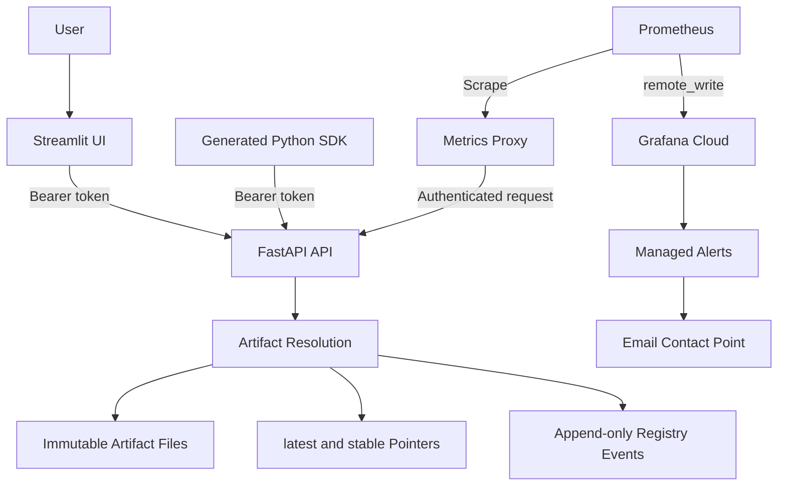

# Architecture

## Components

## Product stack

The product Compose stack contains:

- `textclf-api`: FastAPI model-serving process
- `textclf-ui`: Streamlit client
- `metrics-proxy`: internal Nginx proxy that authenticates Prometheus requests
- `textclf-web-proxy`: public Nginx entry point for HTTPS traffic

Only the reverse proxy exposes public HTTP/HTTPS ports. The API and internal
metrics endpoint remain on the Docker network.

## Monitoring stack

Prometheus scrapes the metrics proxy, evaluates local Prometheus rules, and
remote-writes time series to Grafana Cloud. Grafana dashboards and managed alert
rules consume the remote metrics. The `E2EPRAIIP` contact point sends firing and
resolved notifications by email.

## Trust boundaries

- Browser users interact with the Streamlit client rather than receiving its service token.
- Application endpoints validate scoped bearer tokens from the mounted registry.
- `/health` and `/ready` are public; detailed health and metrics remain internal.
- Runtime secret files are mounted separately from images and source code.
- Model artifacts are host-mounted so application releases do not rewrite model state.

## Generated client flow

FastAPI publishes an OpenAPI schema. The client-generation workflow converts
that schema into the `textclf_client` package. `client_demo.py` exercises the
generated SDK with a separately scoped local client token.

