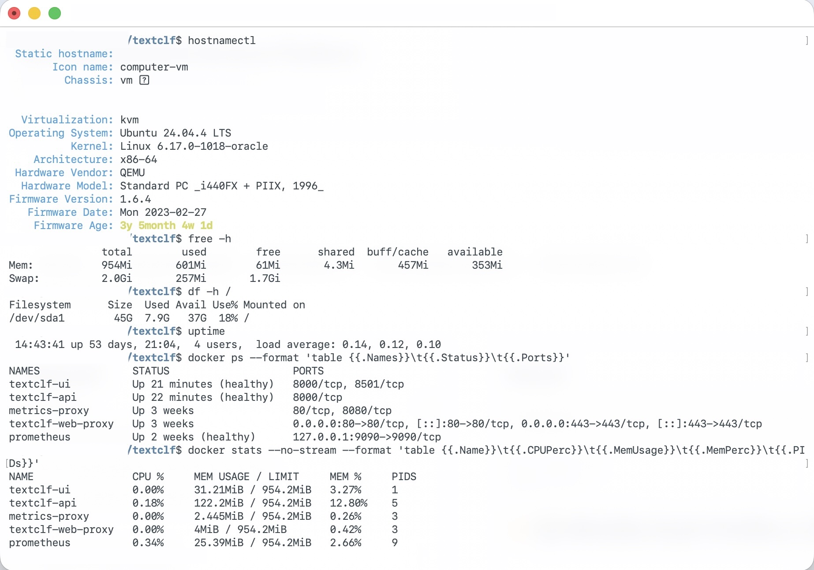

# Deployment and Operations

## Deployment progression

The system was validated through progressively more realistic environments:

1. Local Python processes with Uvicorn and Streamlit
2. Local Docker Compose
3. Ubuntu Server VM validation
4. Oracle Cloud Infrastructure Ubuntu VM deployment
5. Automated GHCR image delivery and remote deployment
6. Prometheus/Grafana monitoring, alerting, and recovery procedures

## Local development

```bash
python3.11 -m venv .venv
source .venv/bin/activate
pip install -e ".[dev]"
make train-save
AUTH_ENABLED=false MODEL_POINTER=latest make api
```

This example disables authentication only for the loopback-bound development
API. Use Python 3.11 to match CI; the initial training run downloads the dataset.

Run the UI separately with `make ui`. Configuration examples live in
`.env.example` and `deploy/.env.example`; real secrets must not be committed.

## Container deployment

The repository contains development Compose files at the root and focused
production definitions under `deploy/`:

- `deploy/docker-compose.product.yml`
- `deploy/docker-compose.monitor.yml`
- `deploy/token-principals.yml`

Images are published to GHCR for `linux/amd64` and `linux/arm64` with `latest`,
`main`, and commit-specific tags. These are CPU architectures: AMD64 covers Intel/AMD x86-64 CPUs, while ARM64
covers ARM CPUs, including Apple Silicon through Docker. Ubuntu can run on either.
Production model artifacts are mounted from
the host rather than baked into the image.

Common local stack commands are:

```bash
make product-up
make product-logs
make monitor-up
make monitor-logs
```

These Make targets use the root Compose files, not the production files under
`deploy/`. They need their own secrets and environment configuration.
Corresponding `*-down` targets stop each stack.

## Production layout

The OCI VM runs Ubuntu Server 24.04 LTS. Nginx provides the public HTTPS entry
point using Let's Encrypt certificates; Cloudflare supplies DNS. The API and
metrics interfaces remain internal to the VM/Docker networks.

The principal runtime locations are:

```text
/home/deploy/textclf/                 deployment files, artifacts, and logs
/home/deploy/textclf_secrets/         mutable consumer and monitoring secrets
/home/deploy/.config/textclf-backup/  restic and object-storage configuration
```

See [`../deploy/README.md`](../deploy/README.md) for stack-specific commands.

## Validation

Useful non-secret operational checks include:

```bash
docker ps --format 'table {{.Names}}\t{{.Status}}\t{{.Ports}}'
docker stats --no-stream
curl -fsS https://<DOMAIN>/_stcore/health
curl -fsS http://127.0.0.1:9090/-/ready
```

The API has no published host port, so `localhost:8000` is not its production
address. Check it from inside its container, or use the public UI to make a
prediction through Streamlit's internal API connection. `/_stcore/health` checks
Streamlit only; `/-/ready` on port 9090 checks Prometheus readiness, not scrape
success. Inspect Prometheus targets to confirm metrics collection.

The following sanitized runtime capture records the OCI VM platform, host
capacity, container health, and per-container resource use without exposing
machine identifiers or credentials.



## Secrets, backup, and recovery

Production credentials live outside Git and container images. Restic creates
encrypted backups in OCI Object Storage with retention management. Backup
credentials are stored separately from the data being backed up.

A systemd timer performs daily backups, and successful service-token rotation
triggers an immediate backup. Restoration was tested before production use.

The backup/restore helpers and systemd unit files are currently host-managed
operational files installed on the VM; they are documented here but are not
version-controlled. Grafana contact-point credentials are also intentionally
external to the repository.

## Release independence

- Code releases select immutable container images.
- Model deployment mounts immutable artifacts and resolves explicit pointers.
- `stable` promotion is independent of application releases.
- Secret rotation and restoration are independent of both code and model state.

This separation reduces accidental coupling and makes rollback decisions more
targeted.
