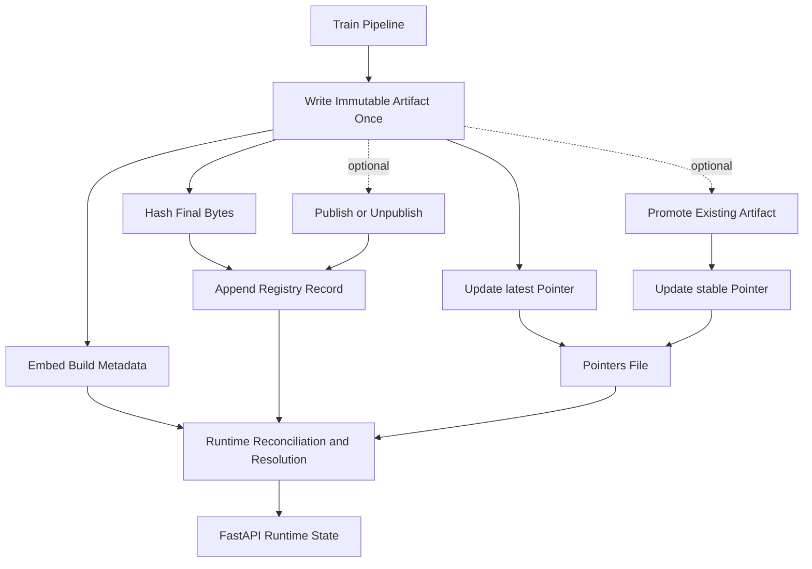

# Model Lifecycle

## Lifecycle



## Immutable artifact data

Each joblib artifact contains the fitted model pipeline and build-time metadata,
including its creation identity. Once written, the artifact is not edited to
reflect later publication or promotion decisions. Its SHA-256 digest therefore
continues to identify the same bytes.

## Mutable release state

Mutable state lives outside the artifact:

- `artifacts/runs.model` records creation, publication, and related registry events.
- `artifacts/pointers.json` maps `latest` and `stable` to artifact filenames.
- optional release tags identify controlled published releases.

Promotion changes the `stable` pointer; it does not retrain or rewrite the
artifact. Publication is also recorded externally.

## Reconciliation

When loading an artifact, the application combines its immutable embedded
metadata with subsequent valid registry events. This is reconciliation: the
runtime retains the artifact's build identity while presenting the latest valid
release state.

Malformed registry lines are ignored safely. A later valid record can still
become the effective latest event for the corresponding artifact. Legacy
registry entries remain supported by compatibility tests.

## Resolution

Consumers may request `stable`, `latest`, a published release tag, or a
supported model identifier or artifact filename, depending on configuration.
The API resolves the selector to one immutable file, verifies registry and
metadata consistency, and exposes the resolved identity through `/version` and
prediction responses.

## Operational separation

Application images, model artifacts, and mutable secret state have independent
lifecycles. Deploying new code does not silently replace the selected model,
and promoting a model does not require rebuilding the application image.

## Administration commands

```bash
# Train and save a new immutable local artifact
make train-save

# Inspect registry consistency without mutation
make audit-models

# Reconcile supported registry inconsistencies
make reconcile-models

# Publish an existing artifact with optional CLI arguments
make publish ARTIFACT=artifacts/model.joblib \
  PUBLISH_ARGS='--release-tag v1.3'

# Point stable at an existing artifact
make promote ARTIFACT=artifacts/model.joblib
```

Publication and promotion operate on an already-created artifact. They do not
rewrite its embedded metadata or digest.
