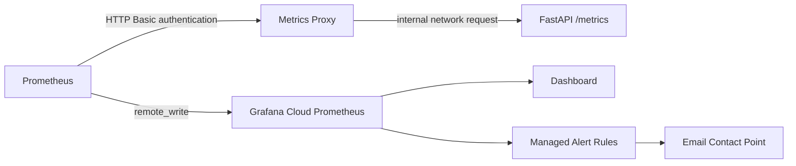

# Observability

## Metrics path

The VM runs the existing `prom/prometheus` container image. It reads the mounted
configuration and requests `http://metrics-proxy:8080/metrics` over the
`textclf_observability` Docker network. Nginx checks HTTP Basic credentials
against a mounted `htpasswd` file (plain username, hashed password). Prometheus
reads the actual password from a separate mounted secret.

Nginx forwards accepted requests to `http://textclf-api:8000/metrics`. The API
checks the source IP against its internal ranges; the proxy does not inject a
monitoring bearer token. Another client with network access and valid credentials
can use the proxy, and trusted containers can reach the API directly. This
internal HTTP connection is not encrypted.

The API Python library exposes counters, latency buckets, process measurements,
and token audit results. Prometheus stores timestamped samples locally, then
sends them outbound to Grafana Cloud with separate remote-write credentials.
Grafana Cloud does not need incoming access to the VM. Local retention is
configured for two hours and 256 MB. The Prometheus web interface binds to
`127.0.0.1:9090` on the VM; remote operator access can use an SSH tunnel.

## Dashboard

The version-controlled dashboard is
[`../grafana/dashboards/e2epraiip-overview.json`](../grafana/dashboards/e2epraiip-overview.json).
It includes:

- API status and uptime
- request rate and predictions processed
- prediction errors and error rate
- average, P50, P90, P95, and P99 prediction latency
- CPU, RSS memory, open file descriptors, and Python GC activity
- token-registry validity
- expired and near-expiry token counts
- token days remaining

Histogram thresholds range from 1 millisecond to 10 seconds, allowing percentile
estimates to represent slower predictions beyond one second. RSS means Resident
Set Size: process memory currently resident in physical RAM.

The `up` metric reports scrape success, not proof that predictions work. A proxy
or authentication failure also makes `up` zero. `prediction_requests_total` counts every call entering the prediction handler,
including failures. `prediction_request_errors_total` counts each failed handler
call once. Authentication, schema validation, and any other rejection before
handler entry are excluded from both counters and the latency histogram. Each
batch is one call, not one count per text. The error-rate panels estimate failures
as a fraction of these admitted calls; their denominator floor can understate
the ratio during very low traffic.

After deploying this correction, historical counter samples retain the old
semantics. Interpret charts only after their query window contains new samples.

The security-oriented panels expose registry validity, expiry counts, and the
remaining lifetime of active service tokens without displaying token values.

## VM-hosted Prometheus rules

[`../monitoring/alerts.yml`](../monitoring/alerts.yml) contains local Prometheus
rules evaluated on the VM, not on a developer laptop. No Alertmanager destination
is configured, so these rules can fire in Prometheus without sending email.
Grafana-managed rules provide the documented email notifications.

Both `monitoring/prometheus.yml.tmpl` and `monitoring/prometheus.yml` are tracked.
The latter remains tracked despite its `.gitignore` entry and is the file copied
by the deployment workflow. Both specify fifteen-second scrape and rule evaluation intervals. The mounted
file determines runtime behaviour. Deployment-specific remote-write values in the
tracked file are still configured separately from the template.

## Grafana-managed rules

The export at
[`../grafana/alerting/e2epraiip-1m.yaml`](../grafana/alerting/e2epraiip-1m.yaml)
contains six rules:

1. API unavailable
2. prediction errors
3. token registry invalid
4. active token expired
5. token expiry warning
6. high prediction latency

All rules use the `service=e2epraiip` label for notification routing. The
Grafana contact point and routing are currently configured separately; this
repository does not provision them. They can be managed as code through Grafana
Cloud tooling such as Terraform while credentials remain outside Git. Separate
manual setup is a current implementation choice, not a security requirement.
Firing and resolved email delivery were both verified in the documented deployment.

| Firing notification | Resolved notification |
| --- | --- |
|  |  |

## Dashboard as code

The Grafana deployment workflow and `scripts/sync_grafana_dashboard.sh` publish
the version-controlled dashboard. The alert YAML is an export/restore artifact;
it does not provision the contact point or notification routing. See
[Grafana Cloud provisioning](https://grafana.com/docs/grafana-cloud/observe-and-act/alert-and-measure-reliability/alerting/set-up/provision-alerting-resources/)
for supported automation methods. Disk-based provisioning is not available in Grafana Cloud.
