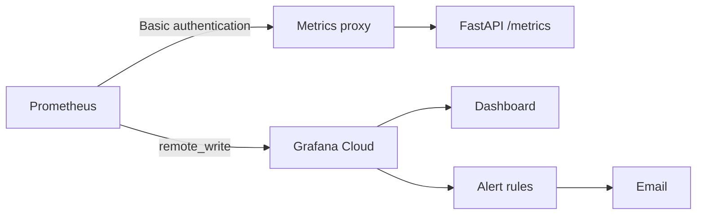
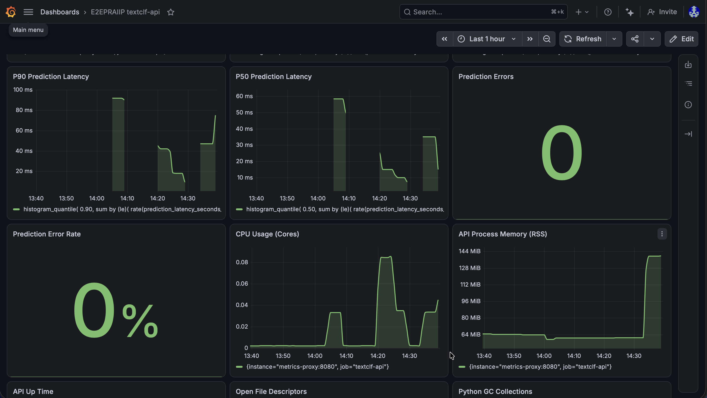
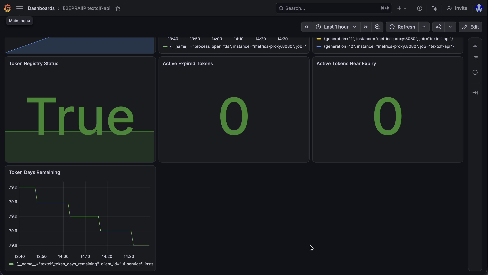
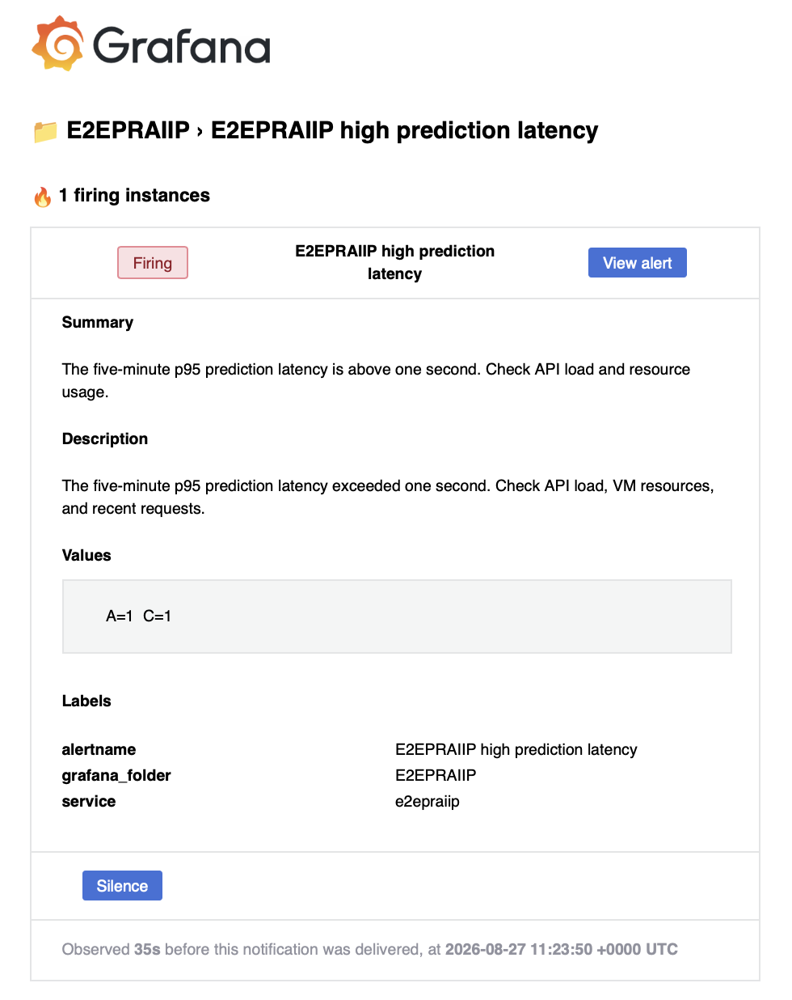
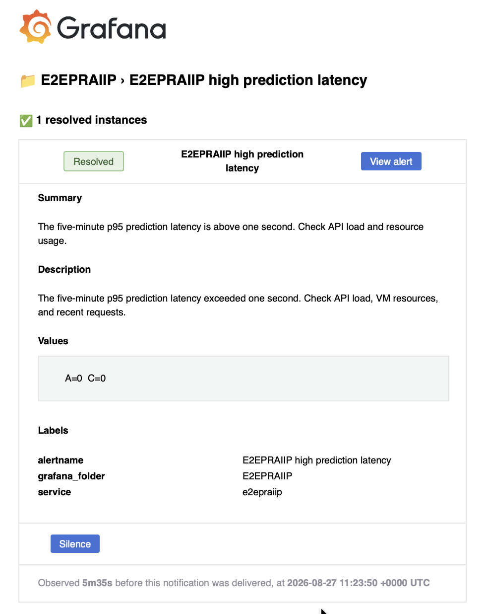

# Observability

Prometheus runs on the VM and collects metrics from the API every 15 seconds.
It keeps recent data locally and sends it to Grafana Cloud, where the dashboard
and email alerts are configured.

## Metrics collection

The API uses `prometheus_client` to expose prediction counts, errors, latency,
process resources, and token expiry information at `/metrics`.

Prometheus requests `http://metrics-proxy:8080/metrics` through the
`textclf_observability` Docker network. The Nginx metrics proxy checks its
username and password against a mounted `htpasswd` file, then forwards the
request to `http://textclf-api:8000/metrics`. Prometheus reads its password from
`/run/secrets/prometheus_metrics_password`.

The metrics proxy has no public port. Access requires both network access and
valid credentials. The API also accepts direct metrics requests from trusted
internal addresses. Traffic between these containers uses HTTP; HTTPS is used
for the public website and remote writes to Grafana Cloud.



Prometheus stores up to two hours of recent data with a 256 MB retention limit.
Its web interface is available at `http://127.0.0.1:9090` on the VM. An SSH tunnel
can be used to access it from another machine.

## Configuration

[`prometheus.yml.tmpl`](../monitoring/prometheus.yml.tmpl) defines the scrape
job, credentials file paths, remote-write destination, and rule evaluation
interval. Both scraping and rule evaluation run every 15 seconds.

The deployment workflow copies the template and generates `monitoring/prometheus.yml`
on the VM. This generated file is ignored by Git. The Grafana Cloud endpoint and
username come from the VM environment; passwords remain in separate secret files.

To generate the configuration manually, run from the deployment directory:

```bash
bash scripts/generate_prometheus_config.sh
```

Set `GC_PROM_URL_FILE` and `GC_PROM_USERNAME_FILE` in `.env` to the files
containing the Grafana Cloud endpoint and tenant ID. The script uses `envsubst`
to insert these two values into the template.
See the [deployment guide](../deploy/README.md#monitoring) for the full sequence.

## Dashboard

The [dashboard JSON](../grafana/dashboards/e2epraiip-overview.json) is stored in
Git and deployed through the Grafana workflow. It shows:

- API scrape status and uptime
- prediction request rate and errors
- average, P50, P90, P95, and P99 latency
- CPU, memory, open file descriptors, and Python garbage collection
- token registry validity, expiry counts, and days remaining

Latency buckets range from 1 millisecond to 10 seconds. This covers both fast
predictions and slower calls when calculating percentiles. RSS (Resident Set
Size) is the process memory currently held in physical RAM.



Each prediction call counts once, including a batch. Failed calls also count
once in the error counter. Requests rejected before the prediction handler,
such as invalid authentication or request schemas, are excluded from these
metrics. The error-rate calculation uses a minimum denominator to handle low
traffic, so it can understate the percentage when requests are very infrequent.

The `up` metric indicates whether Prometheus can scrape the API through the
proxy. A failed scrape can mean an API, proxy, network, or authentication problem.
Use a prediction request to check inference itself.



## Alerts

[Prometheus rules](../monitoring/alerts.yml) evaluate availability, latency,
errors, traffic, and token health on the VM. Pending and firing alerts can be
viewed in the Prometheus interface. Email notifications are handled by Grafana.

The [Grafana alert rules](../grafana/alerting/e2epraiip-1m.yaml) cover:

1. API unavailable
2. prediction errors
3. invalid token registry
4. expired active tokens
5. approaching token expiry
6. high prediction latency

The rules use `service=e2epraiip` for notification routing. The `E2EPRAIIP`
contact point sends an email when an alert fires and when it resolves.

| Firing notification | Resolved notification |
| --- | --- |
|  |  |

The alert YAML is kept for export and restoration. Set up the email contact point
and notification routing in Grafana when creating a new environment. The dashboard
workflow updates the dashboard; it does not create these notification settings.
