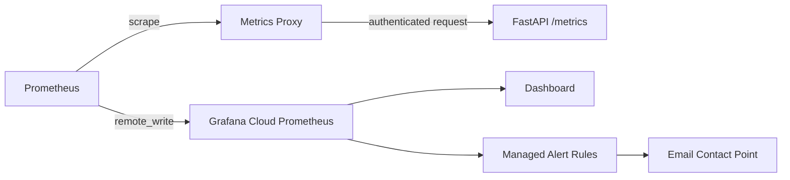

# Observability

## Metrics path

Prometheus does not scrape the protected API endpoint anonymously. It requests
metrics through the internal `metrics-proxy`, which supplies the configured
monitoring credential to the API.

## Dashboard

The version-controlled dashboard is
[`../grafana/dashboards/e2epraiip-overview.json`](../grafana/dashboards/e2epraiip-overview.json).
It includes:

- API status and uptime
- request rate and predictions processed
- prediction errors and error rate
- average, P50, P90, P95, and P99 prediction latency
- CPU, RSS memory, open file descriptors, and Python GC activity
- token-registry validity
- expired and near-expiry token counts
- token days remaining

Histogram buckets cover millisecond through multi-second inference so percentile
panels do not collapse prematurely at a one-second upper boundary.

The security-oriented panels expose registry validity, expiry counts, and the
remaining lifetime of active service tokens without displaying token values.

## Local Prometheus rules

[`../monitoring/alerts.yml`](../monitoring/alerts.yml) contains local Prometheus
rules. Prometheus configuration is stored in `monitoring/prometheus.yml` and its
template, with sensitive remote-write credentials supplied separately.

## Grafana-managed rules

The export at
[`../grafana/alerting/e2epraiip-1m.yaml`](../grafana/alerting/e2epraiip-1m.yaml)
contains six rules:

1. API unavailable
2. prediction errors
3. token registry invalid
4. active token expired
5. token expiry warning
6. high prediction latency

All rules use the `service=e2epraiip` label for notification routing. The
Grafana contact point must be created separately because notification
credentials are not committed. Firing and resolved email delivery were both
verified.

| Firing notification | Resolved notification |
| --- | --- |
|  |  |

## Dashboard as code

The Grafana deployment workflow and `scripts/sync_grafana_dashboard.sh` publish
the version-controlled dashboard. The alert YAML is an export/restore artifact;
it does not contain the email contact-point secret.
