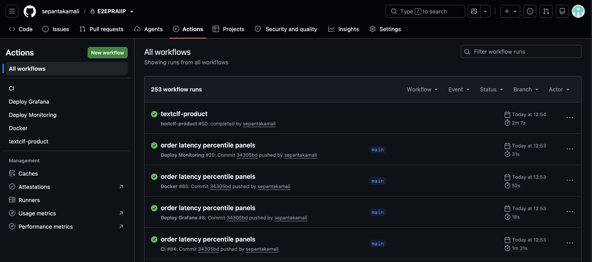

# Testing and CI/CD

## Local quality gates

```bash
source .venv/bin/activate
pytest -q
mypy src admin
```

Runtime dependencies are declared in `requirements.txt`; package metadata and
the development dependency group are declared in `pyproject.toml`. CI installs
both before running its checks. Exact local environments are isolated in a
virtual environment and are not committed.

The tests use isolated temporary directories supplied by pytest's `tmp_path`
fixture. Test artifacts and registry mutations therefore do not modify the
repository's production-like artifact directory.

## Coverage areas

The suite covers:

- non-empty training/test splits, matching text/label counts, and binary labels
- model training and prediction
- API smoke paths, authentication behaviour, and prediction counter/latency semantics
- artifact save, load, identity, and immutability
- `latest` and `stable` promotion
- publication state stored outside the artifact and combined with its metadata
- release-tag uniqueness and controlled version jumps
- malformed and legacy registry compatibility
- token issuance, replacement, auditing, and Prometheus collection
- rotation planning, policy validation, overlap, and finalisation
- consumer-secret installation, verification, rollback, approval, and cancellation

## GitHub Actions

Repository workflows provide:

- **CI:** dependency installation, `mypy src`, and `pytest -q`
- **Docker:** multi-architecture GHCR images for AMD64 and ARM64
- **Product deployment:** authenticated remote update of the production stack
- **Monitoring deployment:** Prometheus and monitoring configuration rollout
- **Grafana deployment:** dashboard-as-code synchronisation

Model artifacts are deliberately independent of container-image publication.
Deploying the latest image does not create, copy, or promote a model artifact.



## Release identification

Container builds receive branch, `latest`, and commit-specific tags as
appropriate. Model release tags and `stable`/`latest` pointers belong to the
separate artifact lifecycle described in [Model lifecycle](model-lifecycle.md).
This prevents application releases from silently changing model selection.
